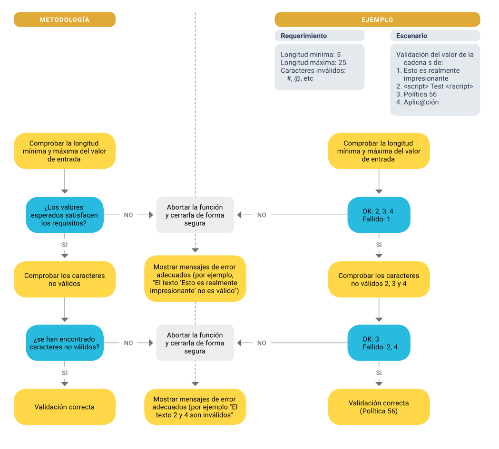

# 3. Programación Segura

## Validación y Saneamiento de Datos

Es una de las más importantes áreas críticas de seguridad en las apli caciones. La mayoría de las vulnerabilidades de las aplicaciones surgen de una incorrecta o insuficiente validación de los datos de entrada o salida que es aprovechada para realizar ataques como Cross-site scripting, inyecciones en general, exposición de datos sensibles o DoS.

Aunque la validación de los datos de salida no es una actividad muy común entre los desarrolladores es igualmente importante, y podría ser explotada por usuarios maliciosos si no se incluyeron medidas de seguridad adecuadas. La salida devuelta por una aplicación podría utilizarse para realizar los mismos tipos de ataque, aunque de una forma más sofisticada.

Implementar validaciones de todos los datos en la entrada y en la salida no garantiza que la aplicación quede libre de vulnerabilidades puesto que dichas validaciones podrían ser insuficientes y no haber tenido en cuenta otro tipo de cuestiones funcionales o de la lógica de negocio que podrían afectar al comportamiento normal de la aplicación. Un ejemplo de esto sería validar un dato de entrada numérico donde se comprueba que es número, que es positivo y que no es 0. Sin embargo, si la aplicación lo utiliza dentro de un bucle iterativo, podría ser llamado con un valor enorme y meter a la aplicación en un bucle casi infinito; lo que sería un ataque DoS

### Técnicas de validación

#### Sanitización de rutas

Todas las rutas de archivos o directorios son normalizadas.  
Por ejemplo, una ruta UNIX como /home/usuario/miArchivo.txt, podría definirse como /var/log/../../home/user/miArchivo.txt. Esto podría ser utilizado por un usuario malicioso para navegar por el sistema de archivos y obtener información no autorizada. Para evitar esto se canonicaliza la ruta a una forma fija o directamente se eliminan las subcadenas “../” y “./” de la ruta.

#### Sanitización de espacios

Todos los parámetros de entrada eliminan los espacios, caracteres de tabulación u otros caracteres blancos (160) por delante y por detrás del dato. Hay quien decide eliminar también todos los caracteres blancos dentro del dato y convertirlos directamente a un código de espacio (32).

#### Sanitización de charset

Se verifica que todos los caracteres introducidos en el dato corresponden al charset esperado. Aquellos que no lo son, se eliminan o se transforman a un espacio blanco. Se tienen en cuenta los caracteres que pueden llegar codificados como “0xA0”, “/xA0”, “%A0”, etc. para que sean decodificados antes de ser procesados.

#### Sanitización de case

Todos los caracteres son transformados a mayúsculas o minúsculas, según lo requiera el parámetro definido.

#### Validación de tipos de datos

Es un proceso para convertir los datos que tienen más de una representación posible en un formato estándar, canónico o normalizado, reduciendo la entrada/salida a una única forma fija convertida y/o reducida. Esta técnica por sí sola ya evita muchos problemas de validación y muchos tipos de ataques.  
Existen librerías para cada tipo de lenguaje que ya incorporan métodos de sanitización.

#### Validación de Formato

Permite validar datos con formatos más o menos complejos y variables pero que pueden perfectamente definirse dentro de una expresión regular. Muchos de los tipos de datos complejos validados del punto anterior probablemente se realicen utilizando esta técnica.  
Lo único que se debe tener presente es crear una expresión regular tan compleja que pueda dar lugar a ser vulnerable a un taque ReDoS. Para asegurase de que esto no ocurra, se debería validar la expresión regular una herramienta que nos garantice su seguridad e idoneidad como: RegEx 101 o RegEx Testing.

#### Validación de tamaños y valores

Valida que el tamaño (longitud) del dato supere un mínimo de caracteres o no supere un máximo. Esta verificación evitaría que enviasen datos tan  
grandes que podrían dejar a la aplicación “colgada” simplemente procesando la entrada.

De igual manera, puede ser necesario validar todos los valores posibles.

#### Validación utilizando listas blancas y negras

La lista blanca valida que el dato se no encuentra dentro de una lista de datos prefijados. Este tipo de validación suele ser insuficiente y peligrosa porque difícilmente puede cubrir todas las posibilidades maliciosas.

La lista negra funciona al contrario: no permite que un valor pase si está definida en una lista de valores peligrosos.

### Diagrama de flujo de validación de entrada/salida

#### Riesgos potenciales

- Cross-Site Scripting: es un tipo de ataque que permite a un usuario malicioso inyectar código en el navegador web de las víctimas
    
- Inyección SQL: aprovecha los fallos de programación de la aplicación a nivel de validación de entradas para realizar operaciones sobre una base de datos de forma ilegítima.
    
- Inyección LDAP: consiste en inyectar consultas LDAP arbitrarias para acceder a datos prohibidos o incluso obtener privilegios adicionales.
    
- Inyección de Log: consiste en inyectar comandos de ejecución en el sistema o cualquier otro tipo de problema utilizando el sistema de registros que registran datos a partir de información parámetros de entrada.
    
- Inyección XEE: una inyección XPATH consiste en la inyección de código XML arbitrario con la intención de acceder a datos a los que no se debe acceder o para obtener información sobre la estructura del árbol XML.
    
- Bomba XML: este ataque trata de sobrecargar el XML excediendo los recursos de memoria de una aplicación para provocar una denegación de servicio.
    
- DoS, DDoS o ReDoS: ataques de denegación de servicio por error del sistema al procesar entradas sin validar que causan fallas en el sistema.
    

#### Recomendaciones de seguridad

- Las validaciones siempre deben realizarse en el lado del servidor. Las validaciones del lado de cliente solo tienen validez como ayuda en UX.
    
- Codificar en HTML todos los campos que hayan podido ser creados o modificados en BBDD por entradas de usuario y que se pinten en la aplicación (EncodeHTML)
- En su defecto, utilizar mecanismos de validación de entrada estándar proporcionados por las bibliotecas específicas de la tecnología utilizada
    
- Cubrir completamente la validación de los datos mediante esquemas de validación o mecanismos estándar que aseguren la entrada de datos mediante: sanitizaciones, tipo de dato, formato, longitudes, valores, listas blancas, listas negras, etc.
    
- Comprobar que los datos estructurados están fuertemente tipificados y validados según un esquema definido, incluyendo los caracteres permitidos, la longitud y el patrón, por ejemplo, números de tarjeta de crédito o de teléfono, o validando que dos campos relacionados son razonables, como validar localidades o códigos postales.
    
- Verificar que los datos no estructurados se sanean para imponer medidas de seguridad genéricas, como los caracteres permitidos y la longitud, y evitar los caracteres potencialmente dañinos.
    
- Asegurarse de que toda la entrada no fiable se sanea adecuadamente utilizando una biblioteca de sanitización.
    
- Evitar mostrar información sensible como consecuencia de un error de validación de algún parámetro recibido.
    
- Aceptar sólo los datos esperados en cada punto de entrada de la aplicación que proceda del usuario, del proceso final de todos los campos de entrada, formularios, URLs, cookies de la aplicación, etc. Cualquier dato inesperado debe ser rechazado.
    
- Verificar que los errores de validación de entrada en el lado del servidor den como resultado el rechazo de la solicitud.
    
- Asegurarse de que todas las consultas a la base de datos están protegidas utilizando consultas parametrizadas para evitar inyecciones SQL.
    
- Comprobar que la aplicación no es susceptible de inyección de comandos.
    
- Verificar que todas las variables de cadena ubicadas dentro del código HTML u otro código del cliente web se codifican correctamente de forma manual en el contexto o que utilizan plantillas que codifican el contexto de forma automática para garantizar que la aplicación no es susceptible a Cross-Site Scripting (XSS) reflejado, almacenado o DOM.
    
- Compruebe que la aplicación no contiene vulnerabilidades de asignación masiva de parámetros (AKA unión automática de variables). Asegúrese de que todos los datos de entrada son validados, no sólo los campos de los formularios HTML, sino todas las fuentes de entrada, como las solicitudes REST, los parámetros de consulta, las cabeceras HTTP, las cookies, los archivos por lotes, las fuentes RSS, etc., utilizando listas blancas, formas de validación menores como las listas grises (que eliminan las cadenas malas conocidas) o las listas negras (que rechazan las entradas malas).
    
- Verificar que la aplicación restringe los analizadores XML para utilizar sólo la configuración más restrictiva posible y garantizar que las funciones peligrosas, como la resolución de entidades externas, están desactivadas.
    
- Verificar que la deserialización de datos no confiables se evita o se protege ampliamente cuando la deserialización no se puede evitar.

## Gestión de Autenticación y Autorización

**AUTENTICACIÓN**

La autenticación es el proceso mediante el cual se verifica la identidad de un usuario o sistema antes de permitirle el acceso a un recurso protegido. En el contexto del desarrollo seguro, la autenticación no solo implica comprobar credenciales, sino hacerlo de una manera que mitigue riesgos como la suplantación de identidad, el acceso no autorizado y los ataques de fuerza bruta.

Una autenticación segura requiere la aplicación de principios y prácticas que aseguren la confidencialidad y la integridad de los mecanismos de autenticación. Estos incluyen el uso de métodos robustos como la autenticación multifactor (MFA), donde se combinan al menos dos de los siguientes factores:

- Algo que el usuario sabe (por ejemplo, contraseña o PIN),
- Algo que el usuario posee (como un token físico o un dispositivo móvil),
- Algo que el usuario es (biometría, como huellas dactilares o reconocimiento facial).

Además, es fundamental garantizar que las contraseñas se almacenen de manera segura mediante el uso de algoritmos de hash con sal y que las sesiones de autenticación utilicen tokens temporales y seguros, evitando la reutilización de sesiones comprometidas. También se deben aplicar políticas de caducidad de contraseñas, límites de intentos fallidos y técnicas de expiración de sesiones para minimizar la superficie de ataque.

Este enfoque asegura que la autenticación no sea solo un punto de entrada, sino una barrera sólida frente a posibles amenazas.

### Tipos de autenticación

#### Autenticación básica

La autenticación básica es un método de autenticación de red. En este método de autenticación, el usuario proporciona un nombre de usuario y contraseña en forma de texto en claro (en base64) por lo que se considera una forma insegura de autenticación. Se recomiendan utilizar otros métodos, como la autenticación de dos factores o la autenticación basada en certificados digitales.

*Riesgos potenciales*

- Ataque MitM (Man-in-the-Middle): la información de autenticación se envía en forma de texto claro, lo que significa que podría ser fácilmente interceptada y leída por cualquier persona con acceso a la información descifrada de la red.
    
- Reutilización de claves: si se utiliza la misma contraseña para varios sitios o sistemas, un atacante que obtenga la contraseña a través de la autenticación básica puede utilizarla para acceder a otros recursos protegidos.
    
- Ataque de fuerza bruta o diccionario: este tipo de autenticación no ofrece una protección adecuada contra estos ataques, en los que un atacante intenta adivinar las contraseñas mediante el uso de programas automatizados.
    
- Autenticación débil: no permite a un usuario demostrar su identidad de manera segura y fiable impidiendo la implementación de medidas de seguridad más fuertes, como la autenticación de dos factores o la autenticación basada en certificados digitales
    

#### Autenticación basada en formulario

La autenticación mediante formularios es un tipo de autenticación basada en contraseñas para un sitio web. En este método de autenticación, el usuario proporciona su nombre de usuario y contraseña mediante un formulario en una página web. El servidor web verifica la información de autenticación recibida y si es correcta, permitirá al usuario su acceso.

*Riesgos potenciales*

Si no se diseña y configura adecuadamente, se corre con los mismos riesgos potenciales que la autenticación básica

#### Autenticación implícita

El usuario no tiene que proporcionar explícitamente credenciales para acceder a un recurso protegido. En lugar de eso, se utilizan otras formas de identificación, como la dirección IP del usuario, la información almacenada en una cookie o un token. Es un tipo de autenticación de red o basada en tokens dependiendo de la forma elegida para proporcionar esta identificación.  
La forma más segura de utilizar este método es utilizar como contraseña el uso de un hash criptográfico basada en ésta con el que obtener un token suficientemente robusto y largo como para que sea inútil utilizar un ataque de fuerza bruta contra él. El servidor compara el token recibido con el token que tiene calculado y almacenado para el usuario que requiere su acceso.

*Riesgos potenciales*

- Acceso no autorizado: si se utiliza información como la dirección IP del usuario para determinar si tiene acceso a un recurso protegido, un atacante puede falsificar esta información y obtener acceso no autorizado al recurso.
- Acceso no autorizado: si se utilizan cookies para almacenar la información de autenticación, un atacante puede obtener acceso a la cookie y utilizarla para acceder al recurso protegido.
- Ataque de fuerza bruta o diccionario: cuando no se hayan utilizado algoritmos de cifrado suficientemente robustos, como MD5, podría ser vulnerable contra estos ataques.
- Autenticación débil: no permite a un usuario demostrar su identidad de manera segura y fiable impidiendo la implementación de medidas de seguridad más fuertes, como la autenticación de dos factores o la autenticación basada en certificados digitales.

#### Autenticación de cliente en HTTPS

Es un tipo de autenticación basada en red en la que se utiliza un par de claves criptográficas, una clave pública y una clave privada, para verificar  un usuario o dispositivo. La clave pública se utiliza para cifrar la información y la clave privada se utiliza para descifrarla. El usuario envía un certificado digital que contiene su clave pública para que el servidor cifre el contenido y luego utiliza su clave privada para descifrarlo.  
La autenticación mediante certificado de clave pública es considerada formas más seguras de autenticación, ya que permite a un usuario demostrar su identidad de manera confiable y segura. Esto es así siempre que el algoritmo de cifrado sea suficientemente robusto para que este método de autenticación sea realmente seguro. Normalmente este método se utiliza para comunicaciones HTTPS (HTTP sobre  
SSL/TLS). El único aspecto negativo a este método es que puede ser más complicada y costosa de implementar que otras formas de autenticación. El certificado de clave pública del cliente es emitido por una entidad de confianza, como una Autoridad de Certificación (CA) que además proporciona una identificación para el portador.

*Riesgos potenciales*

- Acceso no autorizado: si un atacante logra obtener la clave privada de un usuario, puede utilizarla para acceder a los recursos protegidos de ese usuario de manera no autorizada. Si se emite un certificado falso con una clave pública falsa, se podría utilizar para acceder a recursos protegidos de manera no autorizada.
    
- Ataque MitM: interceptando un certificado en tránsito, podría utilizarse para acceder a los recursos protegidos de manera no autorizada.
    
- Manipulación de un certificado SSL: la implementación de certificados que no hayan sido verificados por una CA de confianza o de certificados auto-firmados que podrían ofrecer una falsa sensación de seguridad.
    
#### Autenticación en windows

Este tipo de autenticación, basada en contraseñas, verifica la identificación de un usuario que intenta acceder a un equipo o recurso protegido por Microsoft Windows. Normalmente se hace mediante el uso de un nombre de un usuario y contraseña que son verificadas por el ordenador local o un directorio activo utilizando los protocolos Kerberos y NTLM.

Kerberos utiliza un servidor de autenticación centralizado y claves cifradas para verificar la identidad de los usuarios de manera segura y NTLM utiliza el sistema de archivos local del equipo.

En un entorno de dominio Windows NT o de Directorio Activo, la autenticación de usuario se lleva a cabo mediante el uso de un servidor de autenticación centralizado. Cuando un usuario intenta acceder, su equipo envía una solicitud de acceso al servidor de autenticación y verifica la identidad del usuario utilizando las credenciales almacenadas en el Directorio Activo. Si las credenciales son válidas, el servidor de autenticación emite un ticket de acceso que permite al usuario el acceso.

Este método de autenticación más adecuado en entornos empresariales (Intranet) donde se necesita un control centralizado sobre el acceso a los recursos de la red. Además, al utilizar un Directorio Activo, es posible administrar de forma centralizada las cuentas de usuario y sus permisos de acceso a los diferentes recursos de la red.

Existen dos modalidades de autenticación de windows: a través de SSO (Kerberos es necesario) o consultando LDAP.

*Riesgos potenciales*

- Ataques de diccionario: se basan en adivinar contraseñas mediante el uso de programas que intentan combinaciones comunes de letras y números.
    
- Ataques de fuerza bruta: intentan adivinar la contraseña de un usuario mediante el uso de programas que generan y prueban combinaciones de caracteres hasta encontrar la correcta.
    
- Ataques de MitM: intervienen la comunicación entre el usuario y el servidor de autenticación con el fin de obtener las credenciales del usuario.
    
- Ataques de “replay”: capturan y reutilizan tickets de acceso válidos emitidos por el servidor de autenticación lo que permitiría a un atacante obtener acceso sin tener que conocer la contraseña del usuario. Los sistemas operativos MS Windows incluyen medidas de seguridad que impiden la reutilización de tickets de acceso.
    
- Ataques de phishing: se basan en enviar correos electrónicos falsos que parecen provenir de una fuente confiable con mensajes que utilizan técnicas de ingeniería social, con el fin de obtener las credenciales de un usuario.
    
- Vulnerabilidades de software: los sistemas operativos MS Windows y otros programas utilizados en la autenticación contienen vulnerabilidades que pueden ser identificadas y explotadas por atacantes.
    
- Fallos de seguridad humana: errores o descuidos de los usuarios, como utilizar contraseñas débiles, compartir sus credenciales o permitir que se descubran
    
#### Autenticación SSO

La autenticación de inicio de sesión único o SSO (Single Sign-On) es un mecanismo que permite a los usuarios autenticarse una sola vez y obtener acceso a múltiples aplicaciones o sistemas sin tener que volver a ingresar sus credenciales. Este enfoque simplifica la experiencia del usuario al reducir la necesidad de gestionar múltiples nombres de usuario y contraseñas para diferentes servicios, mejorando al mismo tiempo la seguridad y eficiencia de la autenticación.

En un entorno de SSO, un proveedor de identidad (Identity Provider, IdP) es responsable de autenticar al usuario y emitir un token de autenticación que las aplicaciones o servicios confían para otorgar acceso. Este token, que se intercambia de manera segura, permite que las aplicaciones confirmen la identidad del usuario sin requerir autenticación adicional.

SSO se implementa comúnmente utilizando protocolos de autenticación como SAML (Security Assertion Markup Language), OAuth2, o OpenID Connect, los cuales proporcionan un marco seguro para la transferencia de credenciales y la verificación de identidades. Estos protocolos garantizan que las credenciales del usuario no se compartan directamente entre aplicaciones, sino que se utilicen tokens temporales para gestionar el acceso, reduciendo el riesgo de exposición de credenciales sensibles.

Además de mejorar la experiencia del usuario, SSO ofrece beneficios de seguridad, como una gestión centralizada de las credenciales, lo que facilita la implementación de políticas de seguridad unificadas, como autenticación multifactor (MFA) o control de acceso basado en roles (RBAC). También permite a los administradores deshabilitar el acceso de un usuario en todos los servicios a través de un solo punto, mejorando la capacidad de respuesta ante incidentes.

SSO es una solución que equilibra la facilidad de uso con la seguridad, ofreciendo a los usuarios un acceso simplificado y a los administradores un mayor control sobre la seguridad y el manejo de identidades.

*Riesgos potenciales*

- Punto único de fallo: Si el proveedor de identidad (IdP) es comprometido, todas las aplicaciones y servicios que dependen de SSO quedan vulnerables. Un atacante que obtenga acceso al IdP puede acceder a múltiples sistemas sin necesidad de autenticarse nuevamente.
    
- Robo de token de autenticación: Los tokens de autenticación que se utilizan para validar al usuario en diferentes servicios pueden ser interceptados o robados si no se protegen adecuadamente. Un token robado puede otorgar acceso a varios sistemas sin necesidad de credenciales adicionales.
    
- Falta de control granular: Si no se implementan políticas de autorización adecuadas en cada aplicación o servicio, un usuario autenticado a través de SSO podría obtener acceso no autorizado a recursos que no debería ver, debido a la confianza implícita en el token emitido.
    
- Ataques de phishing: Los atacantes pueden dirigir ataques de phishing para engañar a los usuarios y obtener sus credenciales de SSO. Dado que estas credenciales permiten el acceso a múltiples aplicaciones, el impacto de un ataque exitoso es mucho mayor que con autenticaciones independientes.
    
- Compromiso del proveedor de identidad: Si el IdP es comprometido o mal configurado, un atacante podría emitir tokens falsos o manipular el proceso de autenticación, logrando acceso a servicios sin ser verificado correctamente.
    
- Desconexión insuficiente (Single Log-Out): La falta de un mecanismo de cierre de sesión único (Single Log-Out, SLO) efectivo puede permitir que las sesiones sigan activas en servicios vinculados a SSO incluso después de que el usuario haya cerrado sesión en uno de los sistemas.
    
- Dependencia de un único sistema de autenticación: La implementación de SSO conlleva una dependencia fuerte de la disponibilidad y seguridad del IdP. Si este proveedor sufre un ataque DDoS o presenta problemas de disponibilidad, los usuarios pueden quedar bloqueados de todos los servicios que utilizan SSO.
    
- Tiempo de vida de los tokens: Si los tokens de autenticación tienen un tiempo de vida prolongado sin mecanismos de renovación o rotación, los tokens robados pueden ser reutilizados durante un largo periodo, aumentando el riesgo de acceso no autorizado.
    
- Configuraciones débiles o vulnerabilidades en el protocolo: Una configuración incorrecta del protocolo de SSO (como SAML o OAuth2) puede permitir ataques como man-in-the-middle, replay attacks, o la explotación de vulnerabilidades conocidas en el protocolo.
    
- Falta de autenticación multifactor (MFA): Si no se combina SSO con autenticación multifactor (MFA), la dependencia de una única capa de seguridad (por ejemplo, contraseña) puede facilitar ataques de fuerza bruta o uso de credenciales robadas, lo que comprometería el acceso a todos los sistemas conectados.
    
### Recomendaciones de seguridad

- Garantizar que las contraseñas no se almacenan en un formato legible, de modo que, si el sistema o el recurso que contiene las contraseñas se ve comprometido, el usuario malintencionado sigue sin poder utilizarlas. Un buen método podría ser el uso de funciones que garanticen la irreversibilidad de la operación, como el uso de funciones hash fuertes. También es necesario que se utilicen modifIcadores de hash como puede ser un algoritmo de SALT.
    
- Hay que asegurar que cada página de la aplicación tiene un enlace de desconexión, que la sesión expira cuando el usuario se desconecta y que la sesión expira cuando pasa un tiempo prudente de uso sin actividad. El tiempo de inactividad del usuario recomendado no debe superar los 20 minutos.
    
- No exponer nunca las credenciales en la URL usando parámetros en el querystring
    
- Al usar formularios, utilizar métodos POST para el envío de información desde el cliente al servidor
    
- Utilizar autenticación multifactor
    
- Implementar bloqueo de la cuenta después de 3 intentos fallidos de conexión. El desbloqueo se puede realizar por tiempo superado (por ejemplo 5 minutos) o a través del contacto con un administrador
    
- Después de una introducción de contraseña no válida, se recomienda espera un tiempo aleatorio de entre 2 y 3 segundos. Esto evitará ataques de fuerza bruta y puede sustituir al punto anterior
    
- Evitar mensajes de error muy específicos (por ejemplo: "usuario no válido" o "contraseña no válida"). Es mejor siempre utilizar mensajes genéricos como "credenciales no válidas"
    
- Evitar dar nombres de usuarios en los formularos de recuperación de contraseña.
    
- Deshabilitar el atributo autocompletar en los campos de usuario y contraseña.
    
- Hacer cumplir un mínimo de complejidad al crear contraseñas de los usuarios.
    
- Utilizar siempre cookies de autenticación exclusivas. No deben servir para otros fines que no sea la autenticación de un usuario
    
- Limitar el tiempo de existencia de una sesión en servidor y que esté siempre vinculada al usuario autenticado.
    
- Una vez un usuario se ha autenticado correctamente se debe mostrar una pantalla que informe del número de autenticaciones fallidas y la fecha de la última autenticación válida
    
- Si se está trabajando con un proveedor de identidades a través de SSO, no utilizar nunca el token/cookie de autenticación que proporciona y crear la cookie/token de autenticación.
    
- Evitar el uso de un token JWT para autenticar una aplicación web. Estos tokens están pensados para autenticar comunicaciones a través de servicios web entre servidores.

--- 

**AUTORIZACIÓN**

La autorización se encarga de determinar qué acciones le está permitido realizar a un usuario o sistema, por lo tanto, la autenticación es un  
requisito previo para la autorización, ya que es necesario verificar la identidad de un usuario o sistema antes de determinar qué acciones  
les está permitido realizar. Es el segundo control de seguridad después de la autenticación y está muy vinculado a la autorización sobre las funciones de negocio de la aplicación.

### Riesgos potenciales

- Acceso no autorizado: si la autorización no está implementada de manera adecuada, puede dar lugar a que usuarios no autorizados tengan acceso a recursos y operaciones a los que no debería tener permiso.
    
- Escalada vertical de privilegios: un usuario puede acceder a la funcionalidad de otro usuario con mayores privilegios.
    
- Escalada horizontal de privilegios: un usuario puede acceder a la funcionalidad de otro usuario con el mismo nivel de acceso.
    
- Revelación de información sensible: una aplicación da más información de la necesaria al usuario y podría ser utilizada por  
    un atacante con fines maliciosos.
    
- Violación de la privacidad: si el atacante acaba teniendo acceso a datos relativos a la privacidad de otros usuarios.
    
- Robo de identidad: es cuando el atacante obtiene la identidad de la víctima y la utiliza para realizar algunas acciones.
    
- Robo de datos: es cuando un atacante obtiene ilegítimamente datos, ya sean confidenciales o no. Disponibilidad del servicio: un acceso no autorizado a elementos críticos de la aplicación podría permitir a un atacante interrumpir o dañar el servicio.
    
- Manipulación de datos: un atacante es capaz de interceptar y manipular los datos intercambiados entre el cliente y el servidor.
    
- Modificación de registros: cuando un atacante consigue acceder y editar los registros de la aplicación o del sistema, comprometiendo la integridad de la trazabilidad de los registros.
    
- Path transversal: el atacante se mueve a través del sistema de archivos del servidor, más allá del alcance en el que se supone que debe actuar y fuera del contexto que requeriría una autorización.
    
- Lógica de negocio: si la aplicación no fue bien diseñada podría ocurrir que, si un usuario no sigue la lógica normal de la aplicación para sus funciones de negocio, podría encontrar comportamientos inesperados que podría aprovecharse para realizar operaciones que no deberían haberse permitido.
    

### Recomendaciones de seguridad

- Garantizar la implementación del principio de mínimo privilegio: los usuarios tienen acceso restringido sólo a las funciones y datos que realmente necesitan para realizar su trabajo con normalidad.
    
- Asignar los permisos y privilegios a roles de aplicación, nunca directamente a los usuarios. Los usuarios lo que deben tener son roles y sus privilegios son tomados de éstos.
    
- Comprobar que el acceso de los registros confidenciales está protegido, de modo que sólo se puede llegar a los objetos o datos autorizados  y accesibles para cada usuario.
    
- Utilizar técnicas de maskdata en las bases de datos para proteger información sensible incluso a los desarrolladores
    
- Verificar que la navegación por los directorios esté deshabilitada, a menos que se habilite deliberadamente. Además, las aplicaciones no deben permitir el descubrimiento o la divulgación de archivos o directorios, como las carpetas Thumbs.ds, .DS_Store, .git o .svn. Quedan excluidos los archivos estáticos como pueden ser: javascript, css e imágenes.
    
- Garantizar que las reglas de control de acceso se aplican en el lado del servidor.
    
- Verificar que todos los atributos de los usuarios, los datos y la información de las políticas utilizadas por los controles de acceso no pueden ser manipulados por los usuarios finales a menos que estén específicamente autorizados.
    
- Verificar que existe un mecanismo centralizado (incluyendo bibliotecas que llaman a servicios de autorización externos) para proteger el acceso a cada tipo de recurso protegido.
    
- Asegurarse de que la aplicación utiliza tokens aleatorios fuertes anti-CSRF o que implementa otro mecanismo de protección de transacciones. Solamente queda excluida de esta regla las pantallas de autenticación de un usuario (login)
    
- Registrar todas las operaciones sobre datos sensibles en un registro específico de seguridad donde conste, al menos: la fecha/hora de la operación, la operación (lectura, creación, borrado, actualización), el nombre del dato, el proceso, función o servicio que generó la operación, el usuario, el rol del usuario que tiene el privilegio para la operación, el resultado de la operación (si fue exitosa o no) y un mensaje opcional sobre el resultado de la operación (en caso de error).

---

**GESTIÓN DE SESIONES**

Una sesión es un conjunto de interacciones entre un usuario y la aplicación, mantenidas durante un periodo específico. La sesión permite que el servidor recuerde el estado del usuario y su actividad a lo largo de múltiples peticiones HTTP, dado que el protocolo HTTP es sin estado (stateless), lo que significa que por sí solo no retiene información entre una solicitud y la siguiente.

Una sesión comienza cuando un usuario se autentica o interactúa con la aplicación por primera vez, y generalmente se crea un ID de sesión (un identificador único) que se almacena en el lado del cliente, típicamente en una cookie o en el almacenamiento web local. Este ID de sesión se envía al servidor en cada solicitud para asociar esas solicitudes con el estado del usuario en particular. La sesión también se utiliza para almacenar datos del usuario de manera segura en el servidor.

Como elementos clave de una sesión:

1.  ID de sesión: Un identificador único que vincula al usuario con su sesión en el servidor.
2.  Almacenamiento de estado: La información asociada al usuario, como preferencias, datos temporales, o autenticación, se mantiene en el servidor.
3.  Duración: Las sesiones tienen una duración limitada, generalmente definida por la aplicación. Una sesión puede expirar por inactividad o por el cierre explícito del usuario.
4.  Seguridad: Las sesiones deben ser gestionadas de forma segura para prevenir ataques como la falsificación de sesión (session hijacking) o falsificación de solicitudes (CSRF).

Una gestión adecuada de las sesiones es crucial para mantener la seguridad de las aplicaciones web, ya que las sesiones mantienen el contexto de la interacción del usuario y su autenticación durante toda su navegación en la aplicación.

Por seguridad se debe separar la identificación del usuario de la identificación de sessión: si se utilizan cookies, se deben utilizar una cookie para identificar al usuario y otra su sesión dejando la relación a nivel de servidor.

En cuanto a la identificación del usuario se puede realizar de dos maneras:

- Utilizando cookies:  Es el mecanismo más común porque permite enviar información debidamente cifrada entre peticiones al servidor. Una de sus ventajas principales es que se puede invalidar una cookie entre peticiones haciéndola expirar.
- Utilizando tokens: Es el mecanismo que da una identificación de acceso. La información viaja en una cabecera normalmente llamada bearer.

Debe prevalecer siempre el uso de cookies sobre el uso de tokens cuando se habla de navegación en una aplicación web. La razón fundamental es que la cookie puede ser invalidada entre peticiones al servidor

### Funcionamiento de la sesión desde el lado del cliente

- Un usuario acaba su tarea en la aplicación, abre otra pestaña y cambia de tarea. La sesión del servidor finaliza, pero el cliente no sabe que la sesión ha finalizado mientras no genera actividad en la ventana que dejó olvidada. Esta pestaña podría exponer información sensible que cualquiera que manipulase el dispositivo podría ver y copiar sin necesidad de realizar actividad alguna.
    
- Un usuario debe rellenar un formulario con bastante información que requiere tiempo en ser completado, incluso podría ir rellenándolo a partir de consultas a otras fuentes que requieren su atención. Si el tiempo de expiración de una sesión de servidor se encontrase en 30 minutos por inactividad, después de 2 horas rellenando el formulario, el usuario pulsaría enviar y como la sesión caducó, todo su trabajo quedó perdido y se encontró con un login en la pantalla pidiendo las credenciales de un nuevo acceso. El cliente tuvo actividad durante las 2 horas, pero el servidor no lo pudo percibir.
    
- La información persistente del ID de sesión de cliente, debe quedar guardada asociada a la pestaña, para que cuando desaparezca la pestaña, desparezca toda la información asociada a esta sesión. Esto puede implementarse mediante código dentro de la propia página o mediante el objeto sessionStorage.
    
- La información persistente de la sesión de cliente debe borrarse siempre en la pantalla de login y crearse en el momento haberse creado la sesión en el servidor, no antes.
    
- Permitir que la sesión se cliente pueda hacer transacciones vacías contra el servidor simplemente para indicarle que la sesión debe seguir activa y que no la expire. Este comportamiento debe-  
    ría ser bajo demanda en aquellas pantallas que requieran mucho tiempo de atención del lado cliente, nunca que sea como un comportamiento por defecto.
    
- Como en las sesiones de servidor, éstas deben controlar el tiempo máximo de inactividad con un tiempo similar o inferior al de  
    éstas. En caso de inactividad en el lado cliente, la sesión del cliente debería lanzar una petición de cierre de sesión al servidor y redirigirle a la pantalla de login. Establecer un tiempo máximo  
    absoluto de la sesión también podría ser recomendable.
    
- La información guardada en estas sesiones de cliente deben ser las mínimas y necesarias para la lógica de navegación, y no deberían contener información sensible. Podría contener el  
    token de acceso al servidor para evitar arrastrarlo en todas las peticiones.
    
- Tiempo de espera de inicio de sesión, para evitar ataques de fijación de sesión.
    
- Forzar el cierre de sesión de cliente y servidor en los eventos de cierre de la ventana del navegador o de la pestaña.
    

### Funcionamiento de la sesión desde el lado del servidor

- Crear un identificador único para cada usuario y conexión.
    
- Los identificadores de sesión no deben ser registrados. En caso de necesidad por trazabilidad de las sesiones, utilizar un ID diferente, nunca usar el ID utilizado para la identificación de la sesión en el tráfico cliente-servidor.
    
- Se debe generar un nuevo ID de sesión en cada iniciar la sesión o cuando hay un cambio en el nivel de privilegios del usuario, para prevenir ataques de fijación de sesión.
    
- El almacenamiento y monitorización de los ID de sesión activos debe ser seguro para evitar que pueda ser consultado por personal no autorizado.
    
- La sesión tiene que durar al menos el mismo tiempo que la identificación.
    

### Cierre de sesión

Cuando una sesión de servidor se cierra se debe tener presente los siguientes controles de seguridad:

- Redirigir al usuario siempre a la página de login.
- Asegurarse que el cliente borrará toda la información de la cookie o del token de acceso.
- Asegurarse que el cliente borrará toda la información de la sesión cliente (en su caso).
- Registrar los cierres de sesión en el registro de seguridad

El mecanismo más común para eliminar las cookies es hacerlas caducar.

### Caducidad de la sesión

Los controles mínimos de seguridad sobre la caducidad de la sesión son:

- Toda sesión debe tener un tiempo máximo de vida prudente en caso de inactividad para evitar que la sesión permanezca permanentemente activa.
- Cuando la sesión del servidor caduca debe borrar toda la información relativa a esta sesión.
- Registrar las expiraciones de sesión en el registro de seguridad
- Establecer un tiempo máximo absoluto de duración de una sesión.

### Riesgos potenciales

- Predicción de sesión: se centra en la predicción de valores de ID de sesión que permiten a un atacante evitar el esquema de autenticación de una aplicación.
- Secuestro de sesión: el ataque de secuestro de sesión consiste en explotar el mecanismo de control de la sesión web, normalmente gestionado por un token de sesión.
- Fijación de sesión: consiste en obtener un ID de sesión válido (por ejemplo, estableciendo una conexión con la aplicación), inducir a un usuario a autenticarse con ese ID de sesión y luego secuestrar la sesión validada por el usuario para conocer el ID de sesión utilizado.
- Suplantación de sesión: cuando el atacante gana la identidad de otra entidad para cometer algún tipo de fraude. Por ejemplo, un atacante que genera un sitio web malicioso con la apariencia de un banco legítimo para engañar a sus víctimas mediante phishing.

### Recomendaciones de seguridad

- El id de la sesión no puede exponerse al tráfico no cifrado
    
- Implementar cabeceras eguras con directivas com cache-control o strict-transport security
    
- Las sesiones debe invalidarse cuando el usuario cierra sesión
    
- Las sesiones deben expirar después de un tiempo de inactividad específico.
    
- Garantizar que todas las páginas que requieren autenticación tienen un acceso fácil y amigable a la funcionalidad de cierre de sesión.
    
- Verificar que el ID de la sesión no aparezca nunca en las URL, en los mensajes de error o en los registros.
    
- Garantizar que toda autenticación y re-autenticación exitosa genera una nueva sesión y un nuevo ID de sesión, destruyendo el anterior.
    
- Compruebe que el ID de sesión almacenado en las cookies se define utilizando los atributos HttpOnly y Secure.
    
- Configurar adecuadamente el atributo Path de las cookies de sesión para evitar el acceso a otros dominios.
    
- Comprobar que la aplicación realiza un seguimiento de todas las sesiones activas y permite al usuario finalizar las sesiones de forma selectiva o global desde su cuenta.
    
- En el caso de las aplicaciones de alto valor, asegúrese de que se exige al usuario que cierre todas sus sesiones activas si acaba de cambiar la contraseña con éxito
    
- Limite el acceso a las URLs protegidas, a las funciones, a los datos de la aplicación, a los atributos del usuario y a los datos de configuración de acceso sólo a los usuarios autorizados.
    
- Registrar en un registro de seguridad todas las sesiones que se crean, se cierran manualmente o por expiración desde el cliente o desde el servidor identificadas por el nombre de usuario y el ID de sesión interno del servidor (que no se comparte con el cliente) incluyendo la fecha/hora del evento.
    
## Control de acceso basado en roles (RBAC)

La autenticación basada en roles (RBAC) es un mecanismo de control de acceso que permite gestionar y otorgar permisos a los usuarios según los roles que desempeñan dentro de una organización o sistema. En este enfoque, a cada usuario se le asigna uno o varios roles predefinidos, que determinan qué acciones puede realizar y a qué recursos tiene acceso.

### Características clave:
- Roles predefinidos: Los roles son conjuntos de permisos o privilegios agrupados lógicamente según las responsabilidades de los usuarios (por ejemplo, "administrador", "editor", "usuario").
- Asignación de roles: Los usuarios no reciben permisos de forma individual, sino que se les asignan roles que ya tienen los permisos necesarios. Esto facilita la gestión de permisos en sistemas con muchos usuarios.
- Simplicidad y escalabilidad: Al agrupar permisos bajo roles, es más sencillo escalar y administrar el acceso a medida que el sistema crece o cambia.

### Ventajas:
- Facilidad de administración: Los administradores pueden controlar los accesos de manera centralizada mediante la asignación de roles, lo que simplifica la gestión en sistemas grandes.
- Mayor control: Es fácil modificar permisos o añadir nuevos roles para ajustarse a cambios en la organización sin tener que modificar los permisos de cada usuario.
- Seguridad mejorada: Al evitar la asignación directa de permisos, se minimizan los riesgos de errores de configuración que podrían conceder accesos no autorizados.

## Manejo Seguro de Errores y Excepciones

La gestión de errores trata sobre cómo evitar mostrar información relevante o sensible a los usuarios que pudieran ser utilizados par alanzar otros tipos de ataques sofisticados contra la aplicación y como tratar los errores no controlados dentro de la aplicación para ofrecer salidas seguras que no permitan situaciones inesperadas que puedan ser utilizadas por usuarios maliciosos.

### Riesgos potenciales

- Denegación del servicio: cuando los errores forzados mediante abuso pueden causar caída del sistema.
- Saltarse la lógica de negocio: cuando se producen salidas inesperadas de la lógica de negocio por forzar excepciones o errores no controlados.

### Recomendaciones de seguridad

- Utilizar mensajes de error genéricos que no den pistas a los usuarios finales sobre ningún aspecto sensible de la aplicación.
- Utilizar un control de excepciones centralizado.
- La aplicación debe manejar los errores sin depender de los mensajes de error del servidor que se muestran a los usuarios.
- Cualquier lógica de control de acceso que conduzca a un error debe denegar el acceso por defecto.
- Analizar con detalle todas las excepciones que pueden aparecer por el uso de librerías del sistema o de terceros en la aplicación, tratarlas adecuadamente y ofrecer una salida segura a la aplicación.
- Utilizar try/catch/finally para asegurar el cierre de todos los recursos en caso de error.
- Registrar todas las excepciones inesperadas en un registro específico donde indicar, entre otras, la fecha/hora del fallo, el usuario que lo causó y el método donde se produjo el fallo, así como información de la excepción. Este registro debería encontrarse en un entorno seguro sólo accesible a usuarios autorizados.
- Ninguna petición debe quedar exenta de manejar los errores adecuadamente.

### Registro seguro

Se debe registrar la actividad de las aplicaciones, eventos de sistema relacionados con la seguridad y acciones del usuario, incluyendo autenticación, autorización, integridad o confidencialidad, accesos fallidos o accesos a datos sensibles.

Los registros de seguridad deben estar especialmente protegidos a nivel de autenticación, integridad, confidencialidad, disponibilidad y trazabilidad, siendo de especial importancia los siguientes:

- Autenticación/Autorización: sólo las personas identificadas y autorizadas pueden tener acceso al registro
    
- Integridad: el registro mantiene una firma de integridad que garantiza que no ha sido manipulado a nivel de registro ni a nivel de apunte. Esta firma se actualiza en cada nuevo apunte incluido en el registro.
    
- Confidencialidad: los datos sensibles del registro son tokenizados, anonimizados o cifrados para evitar que pueda accederse al registro mediante métodos distintos a los implementados para acceder a ellos con garantía de autorización.
    
- Disponibilidad: los registros son guardados con redundancia y copias de respaldo.
    
- Trazabilidad/Auditabilidad: deben ser almacenados de forma segura durante un tiempo de retención para cuestiones de auditoría.
    
### Recomendaciones de seguridad

- No registrar información sensible como contraseñas, información financiera, tarjetas de crédito, datos personales, etc. En estos casos, utilizar tokens, anonimización de la información o cifrado.
    
- Validar los parámetros de los componentes variables que conformarán el apunte de registro para evitar inyecciones y comportamientos inesperados.
    
- Realizar apuntes suficientemente precisos para la seguridad:
    
    - Los intentos de autenticación, especialmente los fallos.
        
    - Los accesos concedidos con los roles asociados al usuario.
        
    - El acceso a los datos sensibles y las acciones realizadas sobre ellos, qué rol es el que se ha utilizado y de qué usuario.
        
    - Los errores de validación de las entradas
        
    - Las excepciones del sistema.
        
    - Las posibles amenazas o intentos de amenaza detectados que pueda controlar la aplicación: inyecciones, ataques de fuerza bruta, enumeración de usuarios, fallos de la lógica de negocio, intentos de operaciones sin privilegios, intentos de path transversal, etc
        
- Utilizar funciones hash para asegurar la integridad de los datos de los registros, como puede ser una firma del registro completo
    
- El registro de seguridad debe ser independiente de otros registros y tener sus propias protecciones de seguridad en el sistema.

## Prevención de divulgación de información sensible

Prevenir la divulgación de información sensible es un aspecto crítico en la programación de aplicaciones seguras. Los datos sensibles pueden incluir contraseñas, claves criptográficas, información personal o financiera, entre otros. A continuación se detallan algunas de las mejores prácticas y técnicas que los desarrolladores deben seguir para evitar la exposición no intencionada de estos datos:

1. Cifrado de datos sensibles
En tránsito: Usa cifrado en las comunicaciones, por ejemplo, mediante TLS/SSL (HTTPS) para proteger los datos mientras viajan entre el cliente y el servidor.
En reposo: Almacena los datos sensibles cifrados, como contraseñas y datos personales, en bases de datos o sistemas de almacenamiento. Para ello, utiliza algoritmos de cifrado robustos como AES-256.
2. Uso de algoritmos de hash seguros para contraseñas
Las contraseñas no deben almacenarse en texto plano. En lugar de ello, se deben hashear usando algoritmos de hash seguros. Además, es importante añadir salt (un valor aleatorio) a cada contraseña antes de aplicar el hash para prevenir ataques de rainbow tables.
3. Protección de claves y secretos
    - No incluir claves en el código fuente: Las claves API, contraseñas, o claves criptográficas no deben estar codificadas en el código fuente ni almacenadas en repositorios de control de versiones (como Git).
    - Uso de almacenes seguros: Utiliza gestores de secretos como HashiCorp Vault, AWS Secrets Manager o Azure Key Vault para almacenar y acceder a claves y otros datos sensibles de manera segura.
    - Variables de entorno: Configura claves y secretos a través de variables de entorno en lugar de incluirlos en archivos de configuración del código.
4. Control de acceso y autorización
Implementa un control de acceso basado en los principios de privilegios mínimos. Asegúrate de que cada usuario o servicio solo pueda acceder a los datos y funciones estrictamente necesarias para su rol. Esto evita la exposición accidental de datos sensibles a usuarios no autorizados.
5. Registro (logging) seguro
Evitar el registro de datos sensibles: No registres contraseñas, tokens, números de tarjetas de crédito, o cualquier dato sensible en logs de aplicaciones. Usa máscaras (********) o anonimización en los casos en los que sea necesario registrar algún dato.
6. Configuración de nivel de logging: Utiliza configuraciones adecuadas de los niveles de logging (INFO, DEBUG, ERROR) para evitar la salida de información detallada de depuración en entornos de producción.
Uso adecuado de configuraciones de seguridad
7. Deshabilitar el modo de depuración en producción: Asegúrate de que las configuraciones de depuración, que pueden revelar detalles internos del sistema, estén deshabilitadas en entornos de producción.
Restricción de acceso a archivos de configuración: Protege los archivos de configuración que contengan información sensible (como claves API o credenciales de base de datos) estableciendo permisos adecuados a nivel de sistema operativo.
8. Prevenir la exposición de información innecesaria
Errores controlados: Las respuestas de error no deben contener información detallada sobre el sistema, como rutas internas, nombres de tablas de bases de datos, o versiones del software utilizado.
Filtrado de salida: Implementa filtros en las respuestas HTTP y en las APIs para asegurarte de que no se expongan datos sensibles como campos que el usuario no debe ver.
9. Monitorización y alertas
Implementa sistemas de monitorización que puedan detectar y alertar sobre actividades sospechosas o intentos de acceso no autorizado. Esto ayuda a identificar brechas de seguridad antes de que se produzcan fugas de datos.
10. Cumplimiento de normativas
Cumple con las regulaciones y normativas de protección de datos aplicables, como el GDPR (en Europa) o el HIPAA (en EE.UU.), que establecen estándares para el manejo de datos personales y la divulgación responsable de brechas de seguridad.

### Criptografía

La criptografía es una técnica utilizada para proteger la información y comunicaciones mediante el uso de códigos o claves secretas, y es una herramienta esencial para proteger la información y las comunicaciones.

La criptografía se puede utilizar de diferentes maneras: como cifrado de datos sensibles para proteger la información o como firma digital para garantizar la integridad de los datos.

#### Uso del cifrado

##### Funciones hash

Un hash criptográfico es una función matemática que, a partir de un conjunto de datos, produce una cantidad fija de datos que se denominan “resumen” o “hash”. En función de la función utilizada el número de datos obtenido puede variar, pero siempre va a generar el mismo número de datos para la misma función, independientemente del número de datos utilizado en la entrada.

La potencia del hash criptográfico es que la probabilidad de generar los mismos datos de salida, en el mismo orden, a partir de una entrada diferente es bajísima, muy improbable. Si esto ocurriese se produciría lo que se llama “colisión”, y este efecto descubierto en una de estas funciones matemáticas, podría aprovecharse por usuarios maliciosos para algunos ataques contra la seguridad. Una función de hash se utiliza comúnmente para verificar la integridad de los datos, ya que cualquier cambio en la entrada original se reflejará en un cambio significativo en el hash resultante. Cuando se alimenta la función de hash con los datos que queremos asegurar, los datos de salida de la función nos ofrecen el hash de verificación. Este hash sólo se podría volver a obtenerse con la misma función, con los mismos datos de entrada y en el mismo orden. Las funciones hash se utilizan para el almacenamiento de contraseñas o para comprobar la integridad de los datos con el fin de garantizar que no han sido modificados.

##### Cifrado simétrico

El cifrado simétrico es un tipo de cifrado en el que se utiliza la misma clave tanto para cifrar como para descifrar la información. Se utiliza para proteger la confidencialidad de la información durante su transmisión o como almacenamiento en un dispositivo. La principal ventaja del cifrado simétrico es que es rápido y fácil de implementar. Su principal desventaja es que ambas partes deben compartir la clave secreta para poder comunicarse de manera segura. Esto puede ser un problema en entornos distribuidos, ya que requiere un mecanismo seguro para compartir la clave de manera confiable.

##### Cifrado asimétrico

El cifrado asimétrico es un tipo de cifrado en el que se utilizan dos (2) claves diferentes, conocidas como clave pública y clave privada, para cifrar y descifrar la información. La clave pública se utiliza para cifrar la información y puede ser compartida sin problemas, mientras que la clave privada se utiliza para descifrarla y debe mantenerse en secreto.  
Las ventajas del cifrado asimétrico es que no se necesita compartir la clave privada para establecer una comunicación segura. La clave pública se puede compartir sin problemas y se utiliza para cifrar la información, mientras que la clave privada se utiliza para descifrarla. Sin embargo, el cifrado asimétrico es más lento que el cifrado simétrico y puede ser más difícil de implementar.

##### Salt

Es una técnica utilizada en la criptografía para fortalecer el almacenamiento de contraseñas. Un "salt" es un valor aleatorio que se agrega a una contraseña antes de aplicar un algoritmo de hashing. El propósito del salt es asegurar que incluso si dos usuarios tienen la misma contraseña, sus contraseñas hashed sean diferentes, ya que el valor del salt es único para cada contraseña.

*Funcionamiento:*

1.  Generación del salt: Al crear o almacenar una contraseña, se genera un valor aleatorio único llamado "salt".
2.  Combinación: El salt se combina con la contraseña antes de aplicar el algoritmo de hash (por ejemplo, SHA-256).
3.  Hashing: La combinación de la contraseña y el salt se pasa a través del algoritmo de hash para generar el valor hashed.
4.  Almacenamiento: Tanto el hash resultante como el salt generado se almacenan en la base de datos.

Cuando el usuario intente autenticarse, el servidor tomará el salt almacenado, lo combinará con la contraseña ingresada, y luego aplicará el mismo algoritmo de hash para verificar si el resultado coincide con el hash almacenado.

*Propósitos del salt:*

- Evitar ataques de tablas rainbow: Las tablas rainbow son tablas precomputadas que contienen hashes de contraseñas comunes. El uso de salt garantiza que cada contraseña hashed sea única, haciendo que estos ataques sean mucho menos efectivos.
- Añadir entropía: Incluso contraseñas débiles obtienen un nivel adicional de seguridad debido a la adición del valor aleatorio.

El uso de un algoritmo salt es una práctica fundamental para mejorar la seguridad del almacenamiento de contraseñas en aplicaciones web, especialmente frente a ataques que buscan explotar patrones comunes en las contraseñas.

##### Data Masking

Esta técnica de ofuscación es propia de la base de datos. El propósito de esta técnica es proteger determinados campos de tablas o colecciones almacenadas en bases de datos de tal manera que algunos usuarios pueden ver el dato correcto y otros enmascarados (como puede ser: \*\*\*\*\*\*)

Esta técnica es muy aconsejable cuando un desarrollador debe acceder a una base de datos de producción para arreglar un bug dado que accedería con un usuario de base de datos que solo puede ver los datos enmascarados preservando la integridad de los datos.

#### Riesgos potenciales

- Exposición de información sensible: los datos sensibles esta-  
    rían en claro para cualquier persona no autorizada.
    
- Robo de credenciales y suplantación de identidad: con la in-  
    formación sensible relativa a contraseñas robada podrían su-  
    plantar la identidad de otro usuario y realizar otros ataques  
    como el spoofing.
    
- Fuga de datos personales: son datos protegidos por regulacio-  
    nes del país cuya violación de la privacidad podría ocasionar  
    sanciones económicas.
    
- Pérdida de reputación de la empresa: como consecuencia de  
    todo lo anterior.
    
- Ataques MitM (Man-in-the-Middle): si las comunicaciones no  
    están bien aseguradas, podrían interceptarse las comunicacio-  
    nes y descifrar todo el flujo de datos para obtener información  
    valiosa que podría servir para otros ataques.
    

#### Recomendaciones de seguridad

- Si es necesario almacenar contraseñas de inicios de sesión en la aplicación se almacenarán usando halt + salt
    
- Si es necesario proteger información sensible se utilizará cifrado o data masking
    
- No devolver nunca un identificador numérico para las acciones de CRUD  de entidades en la aplicación. Utilizar siempre un identificador no predecible como puede ser un GUID.
    
- Comprobar que existe una política explícita sobre el manejo de las claves criptográficas (como la generación, distribución, revocación y desactualización).
    
- Comprobar que el ciclo de vida de las claves criptográficas se aplica correctamente. Es más, si es posible usar anillos de claves se debe usar (por ejemplo a la hora de generar cifrados para cookies o tokens)
    
- Garantizar que las contraseñas confidenciales o la información crítica que residan en la memoria se sobrescriban con ceros en cuanto dejen de utilizarse para mitigar los ataques de volcado de memoria.
    
- Comprobar que los números aleatorios se crean con un nivel de entropía adecuado, incluso cuando la aplicación está sometida a una gran carga.
    
- Comprobar que no se utilizan algoritmos criptográficos obsoletos o débiles como el algoritmo DES de clave simétrica o funciones hash como MD5 o SHA-1 debido a la imposibilidad de garantizar la confidencialidad.
    
- Utilizar las librerías criptográficas existentes y en todo caso utilizar algoritmos o implementaciones criptográficas personalizadas o creadas por el usuario.
    

### Gestión segura de archivos

Es un proceso que involucra la protección de los datos almacenados en archivos para asegurar su integridad, confidencialidad y disponibilidad, incluyendo medidas como la criptografía, la autenticación, la autorización, el control de acceso y la copia de seguridad.  
Este proceso debe considerarse durante la fase de diseño de una aplicación y luego implementarse durante el desarrollo. La mayoría de las aplicaciones cuentan con archivos internos para poder funcionar y, además, si se permite la carga de archivos por parte de los usuarios, se deben establecer los controles de seguridad apropiados

#### Riesgos potenciales

- Acceso no autorizado a los archivos, lo que resultaría en:
    - Revelación de datos.
    - Pérdida de información sensible.
    - Manipulación de datos.
    - Borrado de datos.
- Carga de archivos maliciosos, lo que resultaría en:
    - Ejecución remota de archivos
    - Ataque de denegación de servicio.
    - Infección de malware.
- Falta de copias de respaldo:
    - Falta de disponibilidad del servicio (DoS).
    - Pérdida de datos de usuario.
    - Pérdida de datos de valor para la empresa.

#### Recomendaciones

- Autentificar y autorizar al usuario antes de cargar o descarga cualquier archivo, especialmente si los datos son sensibles.
- No utilizar la entrada proporcionada por el usuario para nombrar archivos o directorios.
- Validar los tipos de contenido no sólo por la extensión, sino también compruebe los tipos MIME para verificar los archivos.
- No permitir la subida de archivos ejecutables a la aplicación.
- Limitar el tamaño de los archivos al mínimo que el servidor pueda manejar sin causar problemas de disponibilidad e impacto a las funcionalidades de la aplicación.
- Antes de procesar los archivos para el servidor, un escáner antivirus verificar que los archivos no tienen malware o virus.
- Desactivar los privilegios de ejecución en los directorios en los que los usuarios pueden subir archivos.
- No utilizar rutas absolutas cuando se proporcione un enlace de descarga al usuario.
- No almacenar los archivos con sus nombres de forma secuencial.
- No utilizar información sensible para nombrar los archivos.
- Hay que asegurar que el control de acceso esté configurado como de sólo lectura.
- Limitar el número de archivos subidos por el usuario.
- Almacenar los hashes de los archivos subidos para garantizar su integridad.

### Transacciones

- Es un conjunto de medidas destinadas a proteger las operaciones financieras y de pago de posibles fraudes o ataques. Estas medidas incluyen:  
    Autenticación de usuario: solo personas autorizadas tengan acceso a las transacciones y cuentas financieras. La autenticación de usuario suele incluir contraseñas seguras y, mejor, autenticación de dos factores.
- Criptografía: ayuda a proteger la información confidencial durante las transacciones.
- Validación de transacciones: para asegurarse de que son legítimas y que no son parte de un fraude o ataque cibernético.
- Monitoreo de transacciones: para ayudar a detectar y prevenir posibles fraudes o ataques en tiempo real.
- Copias de respaldo: un plan de recuperación de datos en caso de un ataque o por pérdida accidental de datos garantiza la disponibilidad de estos.

Toda interacción con una estructura de datos compleja y formada por varios procesos aplicados secuencialmente debe realizarse de una sola vez y de forma segura.  
Se deben cumplir los principios ACID.

#### Riesgos potenciales

- Explotación de la vulnerabilidad Payment Bypass: debido a una inadecuada configuración del sistema de pago. Permite a un atacante manipular los parámetros que se intercambian entre el cliente y el servidor tratando la respuesta antes de ser enviada a la pasarela de pago y eludiendo el sistema de pago en general.
    
- Fraude: haciendo uso de información falsa o manipulando transacciones para obtener beneficios ilícitos.
    
- Robo de información confidencial: para ser usada para hacer daño comercial o para futuros ataques
    
- Interrupción del proceso de transacciones: mediante ataques DoS/DDoS.
    
- Pérdida de datos: por fallos en el sistema, ataques o desastres naturales con consecuencias graves para las transacciones, pudiendo afectar la confidencialidad y la integridad de la  
    información.
    

#### Recomendaciones de seguridad

- La autorización y confirmación de una compra tiene que realizarse en el lado del servidor.
    
- Se debe validar que las firmas utilizadas sean correctas durante el proceso de comunicación con la pasarela de pago.
    
- Validar que el precio está correctamente fijado en el lado del servidor.
    
- Validar que no se reutilicen pagos.
    
- El servidor de pago debe comprobar en cada momento en qué fase de la transacción se está.
    
- Incluir un tiempo de expiración de la autorización para cada transacción relativamente corto.
    
- Garantizar la trazabilidad de las transacciones.
    
- Cifrar las comunicaciones con algoritmos robustos asimétricos.
    
- Registrar con detalle todas las operaciones anonimizando o sinomizando la información sensible.