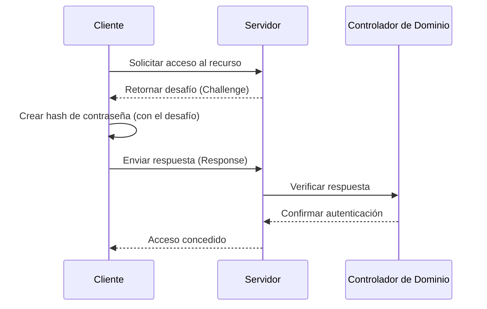
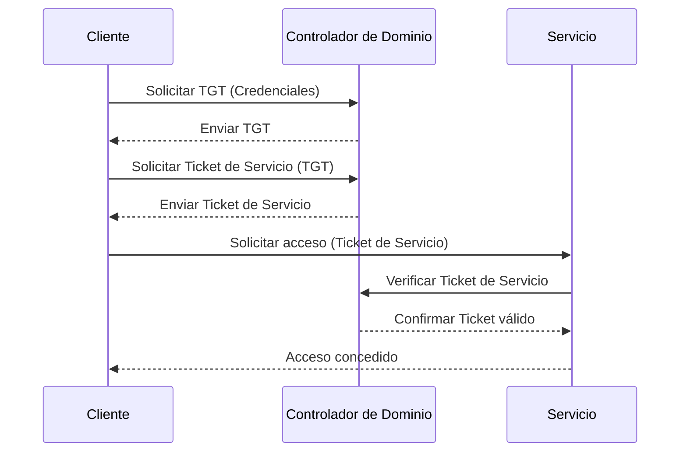
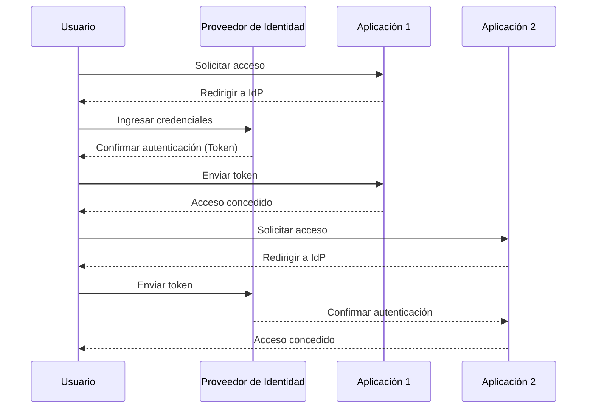
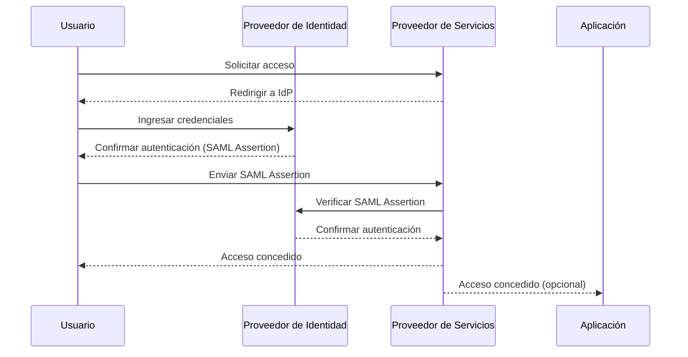
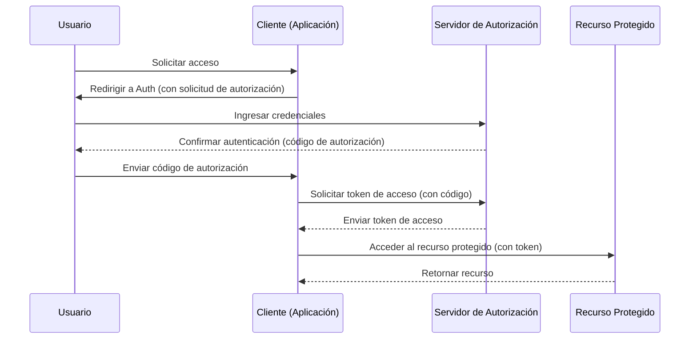
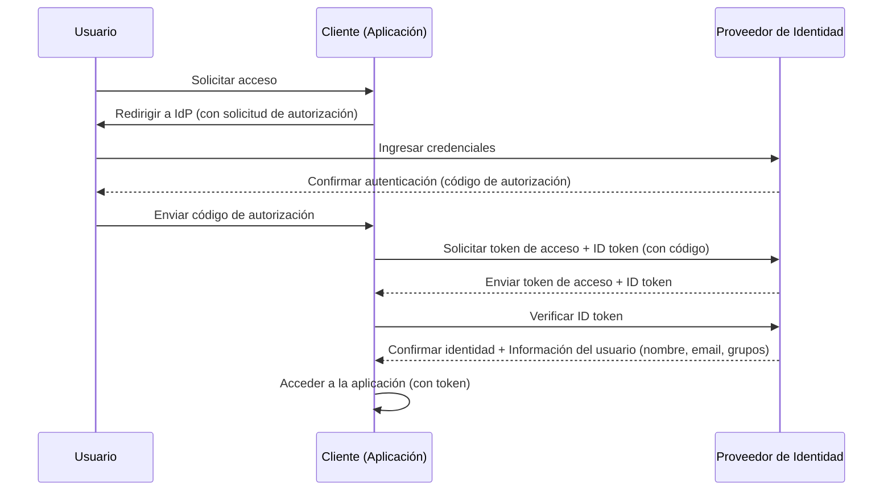

# KNOWLEDGE

## AUTENTICACIÓN EN WINDOWS

### COMO FUNCIONA NTLM

**Descripción**

1. Cliente (C) solicita acceso a un recurso en el Servidor (S).
2. Servidor (S) responde al cliente con un desafío (Challenge).
3. Cliente (C) crea un hash de la contraseña utilizando el desafío recibido.
4. Cliente (C) envía la respuesta (Response) al servidor.
5. Servidor (S) verifica la respuesta con el Controlador de Dominio (D).
6. Controlador de Dominio (D) confirma la autenticación del cliente.
7. Servidor (S) concede acceso al cliente.

### COMO FUNCIONA KERBEROS

**Descripción**

1. Cliente (C) solicita un Ticket Granting Ticket (TGT) al Controlador de Dominio (K) enviando sus credenciales.
2. Controlador de Dominio (K) responde al cliente con el TGT.
3. El cliente utiliza el TGT para solicitar un Ticket de Servicio al Controlador de Dominio (K).
4. Controlador de Dominio (K) envía de vuelta el Ticket de Servicio.
5. El cliente envía el Ticket de Servicio al Servicio (S) para solicitar acceso.
6. Servicio (S) verifica el Ticket de Servicio con el Controlador de Dominio (K).
7. Controlador de Dominio (K) confirma que el ticket es válido.
8. Servicio (S) concede acceso al cliente

## SSO

### GENÉRICO

**Descripción**

1. Usuario (U) solicita acceso a Aplicación 1 (A1).

2. Aplicación 1 (A1) redirige al usuario al Proveedor de Identidad (IdP) para autenticación.

3. Usuario (U) ingresa sus credenciales en el IdP.

4. Proveedor de Identidad (IdP) confirma la autenticación y envía un token al usuario.

5. Usuario (U) envía el token a Aplicación 1 (A1).

6. Aplicación 1 (A1) concede acceso al usuario.

7. Usuario (U) solicita acceso a Aplicación 2 (A2).

8. Aplicación 2 (A2) redirige al usuario al Proveedor de Identidad (IdP).

9. Usuario (U) envía el token al IdP.

10. Proveedor de Identidad (IdP) confirma la autenticación de nuevo.

11. Aplicación 2 (A2) concede acceso al usuario.

### SAML

**Descripción**

1. Usuario (U) solicita acceso al Proveedor de Servicios (SP).
2. Proveedor de Servicios (SP) redirige al usuario al Proveedor de Identidad (IdP) para autenticación.
3. Usuario (U) ingresa sus credenciales en el IdP.
4. Proveedor de Identidad (IdP) confirma la autenticación y envía una SAML Assertion al usuario.
5. Usuario (U) envía la SAML Assertion al Proveedor de Servicios (SP).
6. Proveedor de Servicios (SP) verifica la SAML Assertion con el IdP.
7. Proveedor de Identidad (IdP) confirma la autenticación del usuario al SP.
8. Proveedor de Servicios (SP) concede acceso al usuario.

### OAUTH

**Descripción**

1. Usuario (U) solicita acceso a la Cliente (C) (aplicación).
2. Cliente (C) redirige al usuario al Servidor de Autorización (Auth) con la solicitud de autorización.
3. Usuario (U) ingresa sus credenciales en el Auth.
4. Servidor de Autorización (Auth) confirma la autenticación y envía un código de autorización al usuario.
5. Usuario (U) envía el código de autorización a la Cliente (C).
6. Cliente (C) solicita un token de acceso al Auth utilizando el código de autorización.
7. Servidor de Autorización (Auth) envía un token de acceso a la Cliente (C).
8. Cliente (C) utiliza el token de acceso para acceder al Recurso Protegido (R).
9. Recurso Protegido (R) retorna el recurso solicitado a la Cliente (C).

### OpenID

**Descripción**

1. Usuario (U) solicita acceso a la Cliente (C) (aplicación).
2. Cliente (C) redirige al usuario al Proveedor de Identidad (IdP) con la solicitud de autorización.
3. Usuario (U) ingresa sus credenciales en el IdP.
4. Proveedor de Identidad (IdP) confirma la autenticación y envía un código de autorización al usuario.
5. Usuario (U) envía el código de autorización a la Cliente (C).
6. Cliente (C) solicita un token de acceso y un ID token al IdP utilizando el código de autorización.
7. Proveedor de Identidad (IdP) envía un token de acceso y un ID token a la Cliente (C).
8. Cliente (C) verifica el ID token con el IdP.
9. Proveedor de Identidad (IdP) confirma la identidad del usuario y proporciona información adicional (nombre, correo electrónico y grupos).
10. Cliente (C) accede a la aplicación utilizando el token.