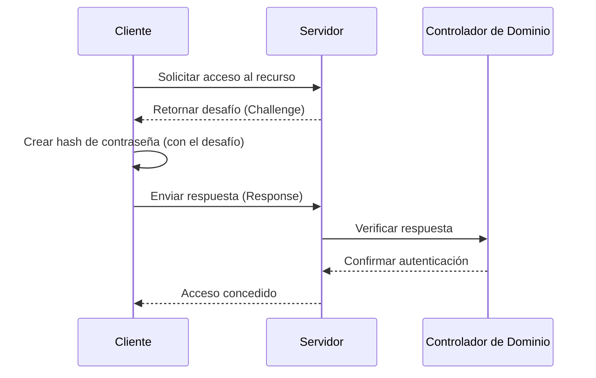
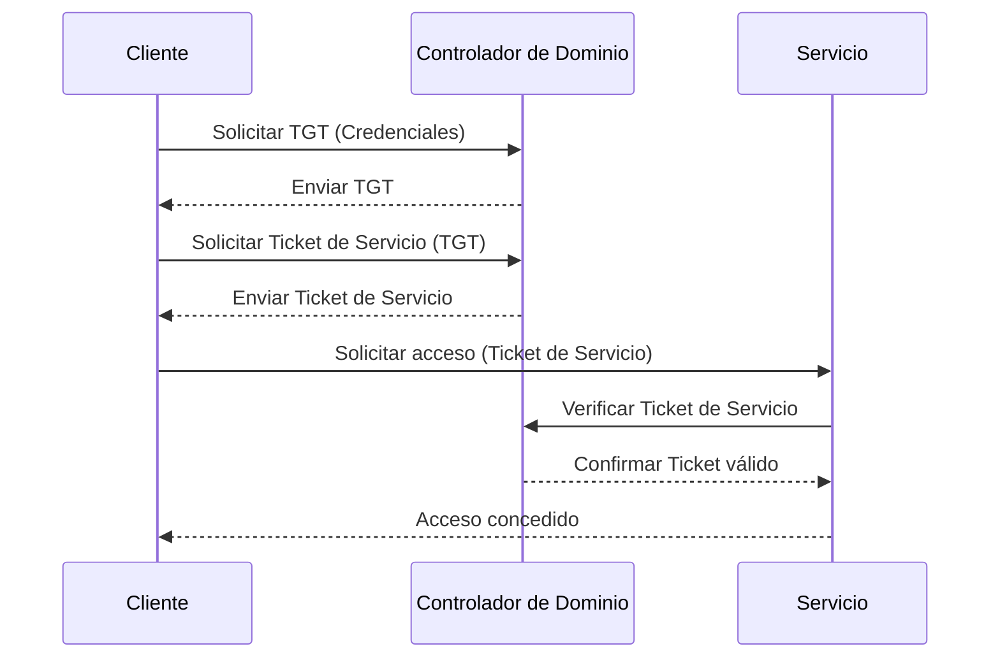
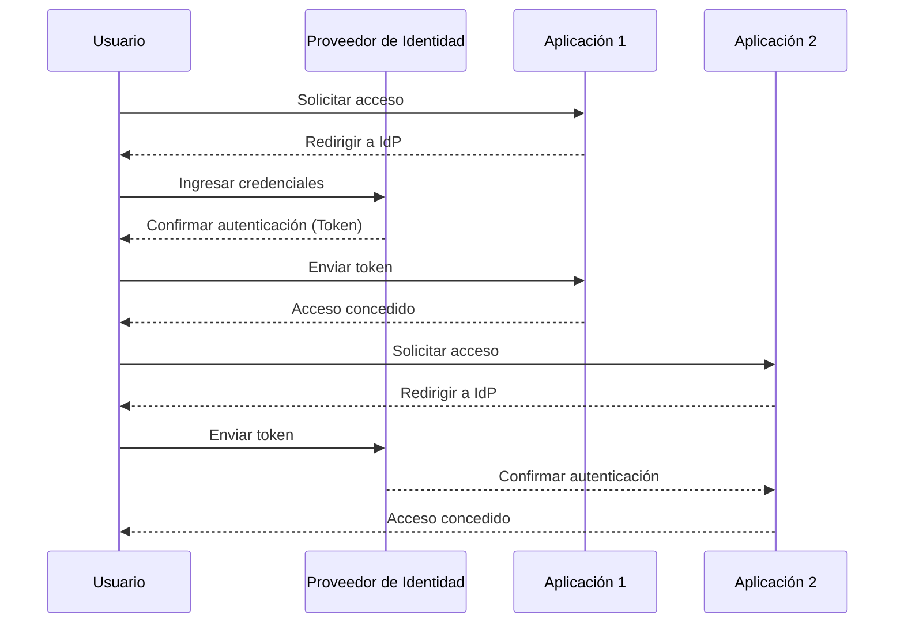
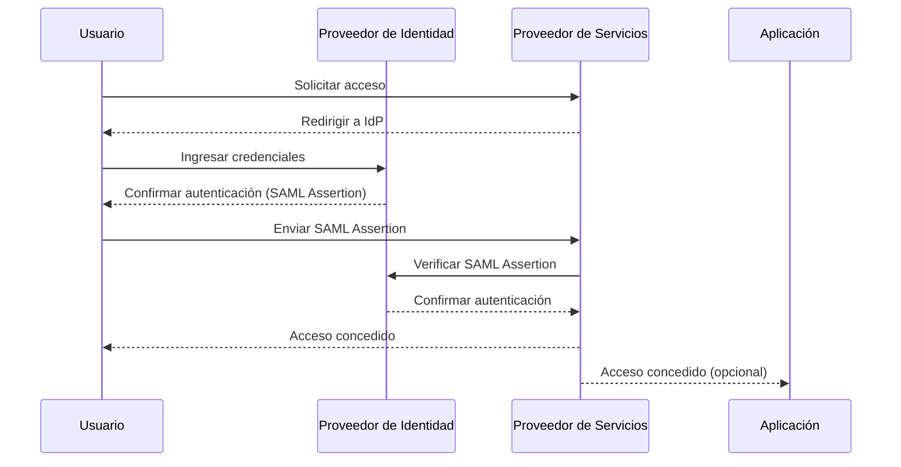
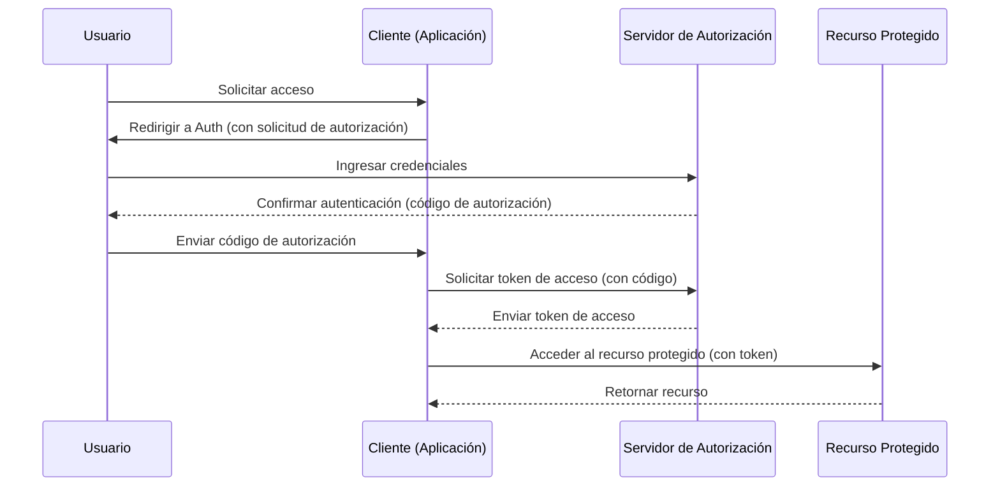
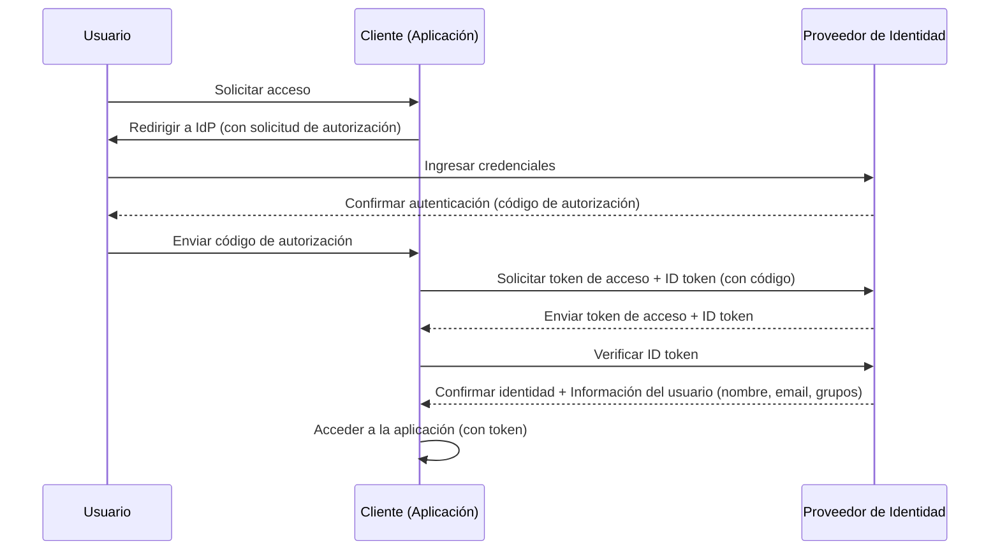

# KNOWLEDGE

## AUTENTICACIÓN EN WINDOWS

### COMO FUNCIONA NTLM


**Descripción**

1. Cliente (C) solicita acceso a un recurso en el Servidor (S).
2. Servidor (S) responde al cliente con un desafío (Challenge).
3. Cliente (C) crea un hash de la contraseña utilizando el desafío recibido.
4. Cliente (C) envía la respuesta (Response) al servidor.
5. Servidor (S) verifica la respuesta con el Controlador de Dominio (D).
6. Controlador de Dominio (D) confirma la autenticación del cliente.
7. Servidor (S) concede acceso al cliente.

### COMO FUNCIONA KERBEROS



**Descripción**

1. Cliente (C) solicita un Ticket Granting Ticket (TGT) al Controlador de Dominio (K) enviando sus credenciales.
2. Controlador de Dominio (K) responde al cliente con el TGT.
3. El cliente utiliza el TGT para solicitar un Ticket de Servicio al Controlador de Dominio (K).
4. Controlador de Dominio (K) envía de vuelta el Ticket de Servicio.
5. El cliente envía el Ticket de Servicio al Servicio (S) para solicitar acceso.
6. Servicio (S) verifica el Ticket de Servicio con el Controlador de Dominio (K).
7. Controlador de Dominio (K) confirma que el ticket es válido.
8. Servicio (S) concede acceso al cliente

## SSO

### GENÉRICO



**Descripción**

1. Usuario (U) solicita acceso a Aplicación 1 (A1).

2. Aplicación 1 (A1) redirige al usuario al Proveedor de Identidad (IdP) para autenticación.

3. Usuario (U) ingresa sus credenciales en el IdP.

4. Proveedor de Identidad (IdP) confirma la autenticación y envía un token al usuario.

5. Usuario (U) envía el token a Aplicación 1 (A1).

6. Aplicación 1 (A1) concede acceso al usuario.

7. Usuario (U) solicita acceso a Aplicación 2 (A2).

8. Aplicación 2 (A2) redirige al usuario al Proveedor de Identidad (IdP).

9. Usuario (U) envía el token al IdP.

10. Proveedor de Identidad (IdP) confirma la autenticación de nuevo.

11. Aplicación 2 (A2) concede acceso al usuario.

### SAML



**Descripción**

1. Usuario (U) solicita acceso al Proveedor de Servicios (SP).
2. Proveedor de Servicios (SP) redirige al usuario al Proveedor de Identidad (IdP) para autenticación.
3. Usuario (U) ingresa sus credenciales en el IdP.
4. Proveedor de Identidad (IdP) confirma la autenticación y envía una SAML Assertion al usuario.
5. Usuario (U) envía la SAML Assertion al Proveedor de Servicios (SP).
6. Proveedor de Servicios (SP) verifica la SAML Assertion con el IdP.
7. Proveedor de Identidad (IdP) confirma la autenticación del usuario al SP.
8. Proveedor de Servicios (SP) concede acceso al usuario.

### OAUTH



**Descripción**

1. Usuario (U) solicita acceso a la Cliente (C) (aplicación).
2. Cliente (C) redirige al usuario al Servidor de Autorización (Auth) con la solicitud de autorización.
3. Usuario (U) ingresa sus credenciales en el Auth.
4. Servidor de Autorización (Auth) confirma la autenticación y envía un código de autorización al usuario.
5. Usuario (U) envía el código de autorización a la Cliente (C).
6. Cliente (C) solicita un token de acceso al Auth utilizando el código de autorización.
7. Servidor de Autorización (Auth) envía un token de acceso a la Cliente (C).
8. Cliente (C) utiliza el token de acceso para acceder al Recurso Protegido (R).
9. Recurso Protegido (R) retorna el recurso solicitado a la Cliente (C).

### OpenID


**Descripción**

1. Usuario (U) solicita acceso a la Cliente (C) (aplicación).
2. Cliente (C) redirige al usuario al Proveedor de Identidad (IdP) con la solicitud de autorización.
3. Usuario (U) ingresa sus credenciales en el IdP.
4. Proveedor de Identidad (IdP) confirma la autenticación y envía un código de autorización al usuario.
5. Usuario (U) envía el código de autorización a la Cliente (C).
6. Cliente (C) solicita un token de acceso y un ID token al IdP utilizando el código de autorización.
7. Proveedor de Identidad (IdP) envía un token de acceso y un ID token a la Cliente (C).
8. Cliente (C) verifica el ID token con el IdP.
9. Proveedor de Identidad (IdP) confirma la identidad del usuario y proporciona información adicional (nombre, correo electrónico y grupos).
10. Cliente (C) accede a la aplicación utilizando el token.

## ANILLO DE CLAVES

El anillo de claves (o keyring, en inglés) es un concepto utilizado en criptografía y seguridad informática para referirse a un almacén o conjunto de claves criptográficas (como claves públicas, privadas o compartidas) que son gestionadas por un software o sistema para realizar operaciones criptográficas como cifrado, autenticación y firma digital.

### Componentes del anillo de claves
Un anillo de claves puede contener varios tipos de claves criptográficas, y las más comunes incluyen:

- Claves privadas: Son usadas para la firma digital o para el descifrado de datos. Son secretas y deben protegerse adecuadamente.

- Claves públicas: Utilizadas para verificar firmas digitales o para cifrar datos que solo pueden ser descifrados por la clave privada correspondiente.

- Claves simétricas: Claves que se usan tanto para cifrar como para descifrar los mismos datos, por ejemplo, en algoritmos de cifrado simétrico como AES.

- Certificados: Un certificado contiene una clave pública y se asocia con la identidad del propietario (normalmente, una entidad certificadora emite y firma los certificados para validar que la clave pública realmente pertenece a esa entidad).

### Uso del anillo de claves
El anillo de claves se utiliza en diferentes contextos para almacenar y gestionar claves criptográficas:

- PGP/GPG (Pretty Good Privacy/GNU Privacy Guard): Uno de los ejemplos más conocidos. En PGP/GPG, el anillo de claves se usa para almacenar claves públicas y privadas que se utilizan para el cifrado de mensajes y la firma digital. Los usuarios pueden intercambiar claves públicas y firmar las claves de otros usuarios para crear una "red de confianza".

- Sistemas operativos: Muchas distribuciones de Linux (por ejemplo, Ubuntu) y otros sistemas operativos (como macOS) utilizan un "anillo de claves" para almacenar credenciales de usuario y contraseñas en un entorno seguro. Los servicios de administración de contraseñas del sistema almacenan las claves y permiten a las aplicaciones acceder a ellas de forma segura.

- Sistemas de gestión de claves (KMS): Servicios como AWS Key Management Service o Google Cloud KMS usan anillos de claves para almacenar y gestionar claves que se usan para cifrar y descifrar datos en sus respectivas nubes.

- Servicios de autenticación: Herramientas como ssh-agent o gpg-agent permiten que las claves de autenticación, como las claves SSH o las claves GPG, se almacenen en un anillo de claves para que los usuarios no tengan que introducir su contraseña o frase secreta cada vez que necesitan usar una clave privada.

###Tipos de anillos de claves
- Anillo de claves públicas: Contiene claves públicas de otras personas que puedes utilizar para verificar firmas o cifrar información para enviarles de forma segura.

- Anillo de claves privadas: Contiene tus claves privadas y públicas, permitiéndote firmar digitalmente y descifrar datos que te hayan sido enviados.

### Operaciones con el anillo de claves
Algunas operaciones comunes que se pueden realizar con el anillo de claves incluyen:

- Añadir claves: Insertar una nueva clave pública o privada al anillo.
- Eliminar claves: Eliminar claves que ya no son necesarias o han caducado.
- Firmar claves: Firmar la clave pública de otra persona para validar su autenticidad y crear una relación de confianza.
- Buscar claves: Buscar una clave específica dentro del anillo por su identificador (por ejemplo, un ID de clave o una huella digital).

### Seguridad del anillo de claves
El anillo de claves debe protegerse adecuadamente para evitar compromisos de seguridad. Si las claves privadas son expuestas, podría ser posible que un atacante realice firmas digitales fraudulentas o descifre mensajes cifrados.

- Cifrado del anillo de claves: Los anillos de claves, especialmente los que contienen claves privadas, suelen estar cifrados con una contraseña o frase secreta. De esta manera, incluso si un atacante accede al archivo del anillo de claves, no podrá extraer las claves privadas sin conocer la frase secreta.

- Gestión y caducidad de claves: Es importante gestionar adecuadamente las claves dentro del anillo, revocando o eliminando aquellas que ya no sean necesarias o que hayan caducado.

### Ejemplo de uso en GPG
Un ejemplo práctico en GNU Privacy Guard (GPG) sería listar las claves dentro del anillo de claves públicas y privadas:

Para listar las claves en el anillo de claves públicas:

```bash
gpg --list-keys
```
Para listar las claves en el anillo de claves privadas:

```bash
gpg --list-secret-keys
```
Para agregar una clave pública al anillo de claves:

```bash
gpg --import publickey.asc
```

### Aspecto de un anillo de claves

```xml
<key id="9cc1d1c0-8633-43c2-81a1-859e0576d0eb" version="1">
  <creationDate>2024-01-02T15:23:27.884758Z</creationDate>
  <activationDate>2024-01-02T15:23:27.8664204Z</activationDate>
  <expirationDate>2024-04-01T15:23:27.8664204Z</expirationDate>
  <descriptor
    deserializerType="Microsoft.AspNetCore.DataProtection.AuthenticatedEncryption.ConfigurationModel.AuthenticatedEncryptorDescriptorDeserializer, Microsoft.AspNetCore.DataProtection, Version=5.0.0.0, Culture=neutral, PublicKeyToken=adb9793829ddae60">
    <descriptor>
      <encryption algorithm="AES_256_CBC" />
      <validation algorithm="HMACSHA256" />
      <encryptedSecret
        decryptorType="Microsoft.AspNetCore.DataProtection.XmlEncryption.EncryptedXmlDecryptor, Microsoft.AspNetCore.DataProtection, Version=5.0.0.0, Culture=neutral, PublicKeyToken=adb9793829ddae60"
        xmlns="http://schemas.asp.net/2015/03/dataProtection">
        <EncryptedData Type="http://www.w3.org/2001/04/xmlenc#Element"
          xmlns="http://www.w3.org/2001/04/xmlenc#">
          <EncryptionMethod Algorithm="http://www.w3.org/2001/04/xmlenc#aes256-cbc" />
          <KeyInfo xmlns="http://www.w3.org/2000/09/xmldsig#">
            <EncryptedKey xmlns="http://www.w3.org/2001/04/xmlenc#">
              <EncryptionMethod Algorithm="http://www.w3.org/2001/04/xmlenc#rsa-1_5" />
              <KeyInfo xmlns="http://www.w3.org/2000/09/xmldsig#">
                <X509Data>
                  <X509Certificate>
                    MIIFzzCCA7egAwIBAgICEFEwDQYJKoZIhvcNAQELBQAwgcIxCzAJBgNVBAYTAkVTMQ8wDQYDVQQIDAZNYWRyaWQxIDAeBgNVBAoMF1NpZGVydGlhIFNvbHV0aW9ucyBTLkwuMQwwCgYDVQQLDANBTkExSTBHBgNVBAMMQEFOQSBTSURFUlRJQSBTT0xVVElPTlMgSU5URVJNRURJQVRFIFNFQ1VSRSBDRVJUSUZJQ0FURSBBVVRIT1JJVFkxJzAlBgkqhkiG9w0BCQEWGHNvcG9ydGVfYW5hQHNpZGVydGlhLmNvbTAeFw0xOTA4MzAxMjAzNDdaFw0yMDA5MDgxMjAzNDdaMIGcMQswCQYDVQQGEwJFUzEPMA0GA1UECAwGTUFEUklEMQ8wDQYDVQQHDAZNQURSSUQxIDAeBgNVBAoMF1NpZGVydGlhIFNvbHV0aW9ucyBTLkwuMQwwCgYDVQQLDANBTkExGjAYBgNVBAMMEWtleS5zZXNzaW9uLmNyeXB0MR8wHQYJKoZIhvcNAQkBFhBhbmFAc2lkZXJ0aWEuY29tMIIBIjANBgkqhkiG9w0BAQEFAAOCAQ8AMIIBCgKCAQEAxoTn2GG40kTCVk8zJIslNsBYQ441XbPInvxqr87bqS9epXbDLhF1XVeA8nm6MuWIysO4/bVOf1QuKEXz6jLexQBk7CBYiwce9nnCJQqdt9azbDAk9P29yVfUU1ukhPbX5Ygoy8yDOUxjzt3GCJYrnqPRWCHj23pEbvNBnGcNaEhoD+wxviYCROBc9FCRvHsVkmj1eUcdfOMICcwsXpyrRzFv1mBkbG0Kapa1LTTtniQAxsd/3vKUthsP2ogurNa4m2Wzu853FOW7B1oA4V7Sl03kj05TT2ThprzbTSd79BpTINQXvcbYNoisn+TDS2ncGO2m5GXQ5L0yoCNRSqIQDwIDAQABo4HyMIHvMCsGA1UdHwQkMCIwIKAeoByGGmh0dHA6Ly9jYS9pbnRlcm1lZGlhdGUuY3JsMAkGA1UdEwQCMAAwEQYJYIZIAYb4QgEBBAQDAgWgMDMGCWCGSAGG+EIBDQQmFiRPcGVuU1NMIEdlbmVyYXRlZCBDbGllbnQgQ2VydGlmaWNhdGUwHQYDVR0OBBYEFLd1B3UO/Taz22WVPIyUxvRbHQ+qMB8GA1UdIwQYMBaAFHR4zB/sfE+qeqU59LdERRT36vJHMA4GA1UdDwEB/wQEAwIF4DAdBgNVHSUEFjAUBggrBgEFBQcDAgYIKwYBBQUHAwQwDQYJKoZIhvcNAQELBQADggIBAFzfOKuXXxgEHAesF8e0IWRpUhfYW1F5nK6CzwdAnSTMQaJ8Z2E3DxlAIVWcu1rmxm82oZOJCVAaMh4IsVtXNyHgU15kDSugvtZDc/kDd+yXZrCvXKfY1UYe+MeA+uJbR6vc943vWsDFTLGf9yiBtNZYq9w+rUIVPvC6udFHUiiwd48DSbj5GkXlIiJJzIdcBqM9YqY/6yHzcvItf1w3y05xe+24S29a3ucEIN+s06fxWKvXf9VVEPBXiJ7z8QU7xv9rVfcyWwcuJrUO2gUUt0v0/wJU4OjF+eP0ziqLxkVdcFTru/DZGS9w3FLKnnDDY6xJfd61+2kzQDWDRf10+wc5lcoWYbCGYDSwMxyZguNVqPec+/aQntDh+TIY7PhKMtoXP1WLNXCEj9XIs9z/UL3rwZmqTWWrLM77GTWljb0Y90189qBN3F8TbI7c6uFiiKfec5lSw5jx+SeGUvN4/r2F2j9jlWqHpkhQKP4f3zMB1O3n9vN966u2CtfmeHwfM56LVhbqlCyWS6XueDMvZM0bONyhqs1ynt24JXGXOCJbiPtbxfRDNDV85TxbpK1f3xFIMHiy5ZYS2X9hFfgHILud10dP6sWb4XtcasbCIoHVTin4gAHZ7GK2kjNn4xU7wmEf5WK4asEw+4gu3RHSjjhNonCPtMmOaGNcB96XLqrO</X509Certificate>
                </X509Data>
              </KeyInfo>
              <CipherData>
                <CipherValue>
                  pWI1691/QdGiscwHevoB8IeJCYqPYljAx9tJFOOUNYHBrqMcdLRfqdb+DIytWoXhQNR43fXmgYksVnofVtzagghhT8C9LT00n7ZrCzn3gp+ITfLFgPVB1ivX/8cu0Kt2S+g2KbPSeQc/K1MaidEu8b7akZ1IDu8FAFq5UdyQbuEXtW9M2wtpF21L5/d/mGPZWFqfgS/9fHjBGSdHhQBTOAZbpotkGny3vU2QJlrxTjlCYBXuAb9G1W82SmHK4NJSVI/h4jSuWimgavgRvv/FiV8k3oQDsVZ0PnSDig9fXq8BxSH2SvF85wvmNo0/4k3WwLhnGEbnBlVJQJIVdqULgg==</CipherValue>
              </CipherData>
            </EncryptedKey>
          </KeyInfo>
          <CipherData>
            <CipherValue>
              ZaE+yxm1+ZkJnWt2/ZRU/FpI/9geZIgYiRl0GS5lI60iHQBPeKydVgce37632Dg3tFtvNY1d/xIp6GJyXrFrPpzkGa/YhhX56TEXnJB/aim6heOIZTmIXtF5kMA4CoRfw51KRb4B7wSuav7CutOAglJXzyTAriosSqIXxwsSCvt1CAjEt4sXqV0nD9uaXQGSrP4qOGAEVYNJPZtPEI1d14sYip9+FHNUuf2+B6SFZnkh+C8CeUg+UZx5lFHIO/JSUTbyc5ttIWRd0/3NlGIsRS8ehqfPMemQ4yR6Vk3nxezNvjEXF1JamWpCpYx1PF7Valj9GZDz7tshTd11t2VBsS7vPKQLTFz+v0OY6uy7s06z6mqc81cqBpgpPJsGUbEVaT7R6datSM0lx4sjwP5bow==</CipherValue>
          </CipherData>
        </EncryptedData>
      </encryptedSecret>
    </descriptor>
  </descriptor>
</key>
```