# CONFIGURE SONARQUBE

## CREATE DOCKER

Ejecutar el siguiente comando en linux shell:

```sh
sudo docker run -d --name sonarqube-custom -p 9000:9000 sonarqube:10.6-community
```
Las credenciales por defecto son: `admin:admin`

## CREATE TOKEN DE AUTENTICACIÓN

1. Una vez logado, pulsar en el icono del usuario A y ver *My Account*

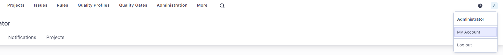

2. En la pantalla de administración pulsar en la pestaña *Security*

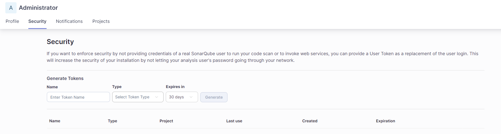

3. Generar un token llamado sonarlint del tipo usertoken y con una caducidad de 30 días. Pulsar el botón Generate

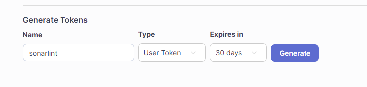

4. Copiar el token generado y copiarlo en la configuración de sonarlint al añadir una conexión sonarqube:

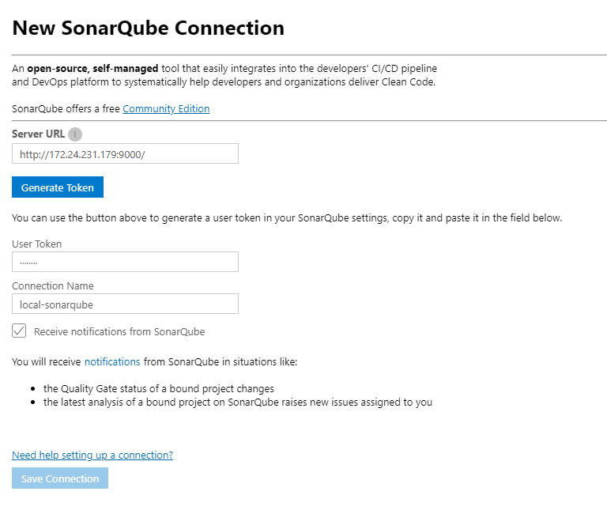

## CREAR PERFILES DE CALIDAD EN SONARQUBE

1. Navegar a QualityProfiles, Seleccionar C# y pulsar en el botón de menús: 

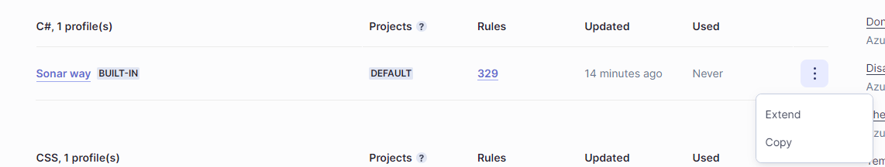

2. Pulsar en extend y seleccionar le nombre c#-extender

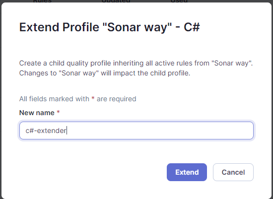

3. Se abrirá la venta de configuración del perfil de calidad c#-extender y se deberá pulsar en el botón activate more
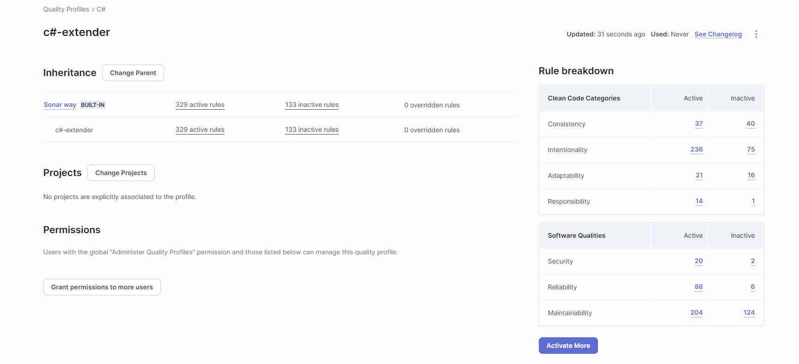

## CONFIGURAR LAS REGLAS DEL PERFIL c#-extender

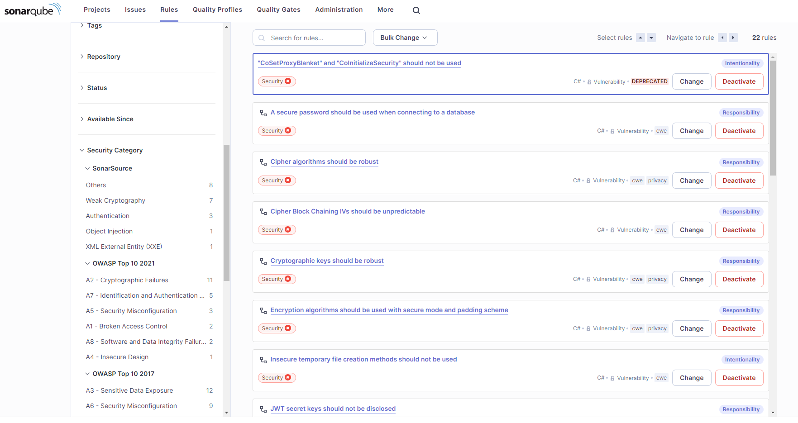

## CONFIGURAR UN PROYECTO

1. Ir a la pestaña Projects y pulsar en *Create a local project*

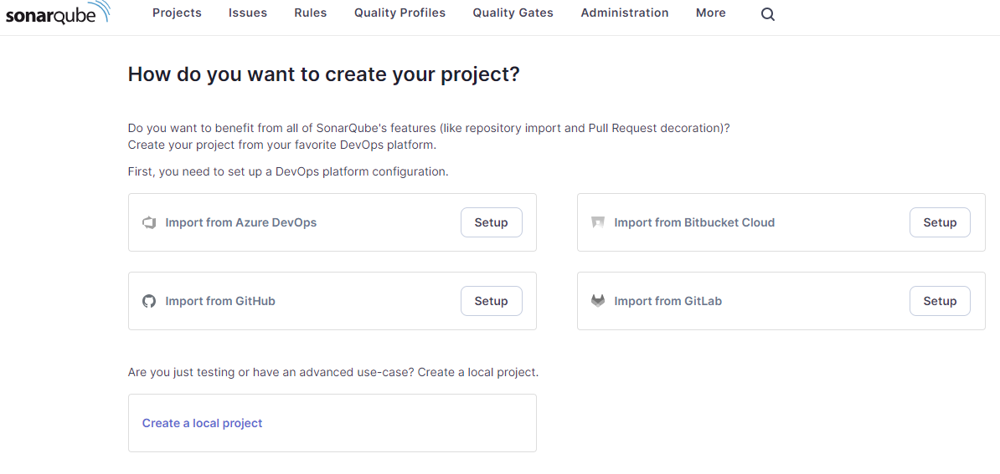

2. Establecer el nombre al proyecto y pulsar el botón *next*

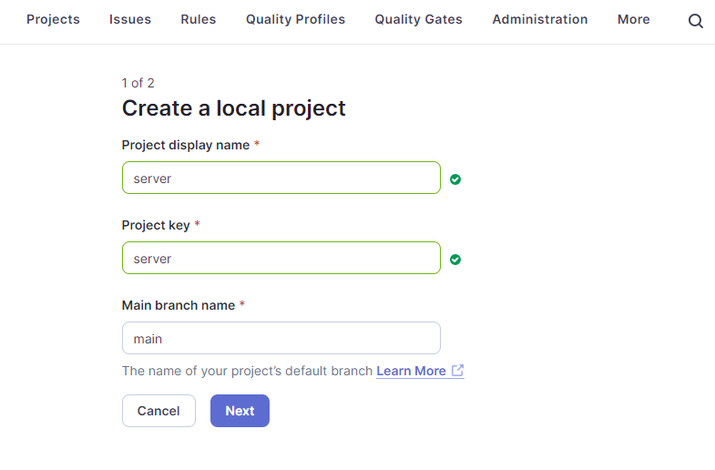

3. Para el modo demostración, seleccionar *Use the global setting* y pulsar en create project

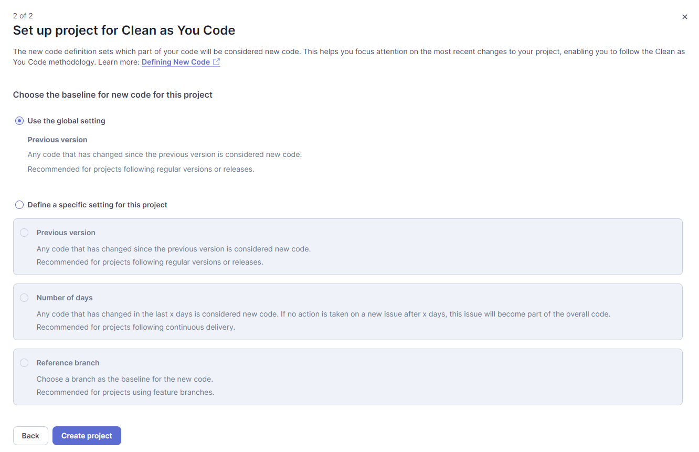

4. Antes de lanzar análisis, se recomeinda seleccionar el Qyuality Profile:

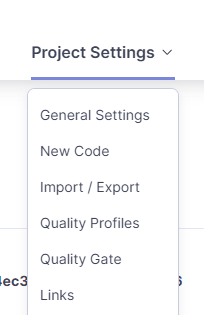
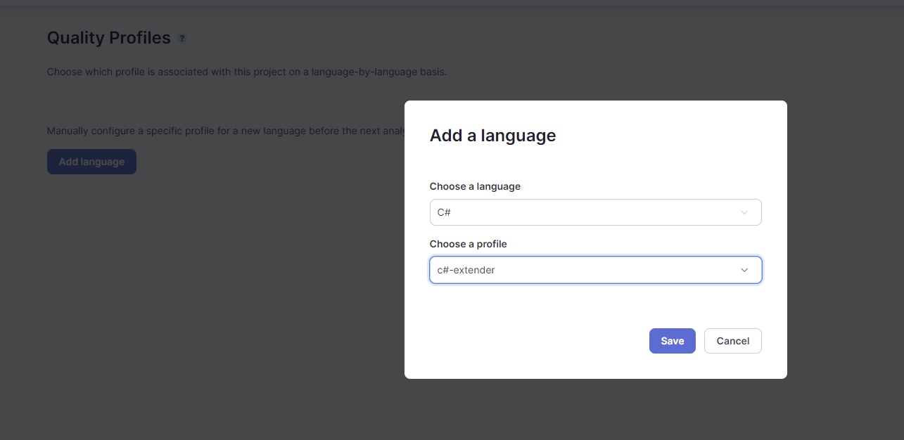


5. En al pantalla *Analysiis Method* Seleccionar *Locally*

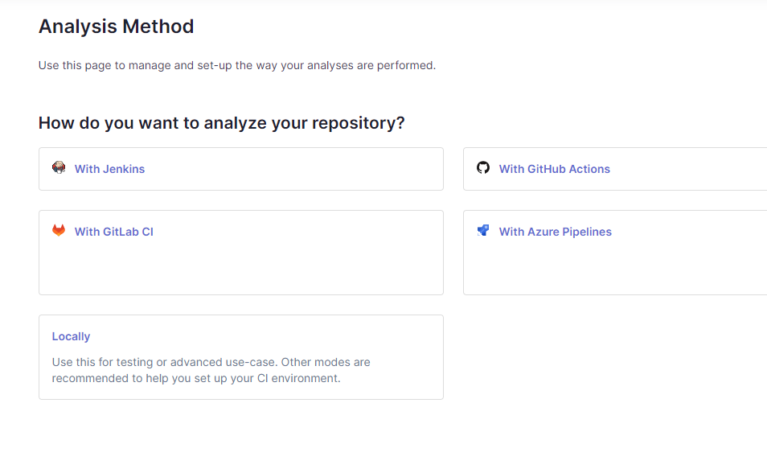

6. Generar un token llamado project_token

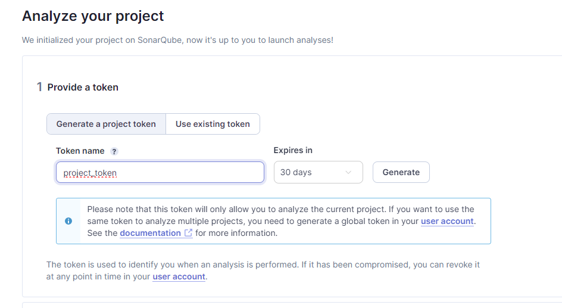

7. Copiar el contenido del token y pulsar continue

8. Seleccionar el tipo de análisis. En este caso se seleccionará el .NET

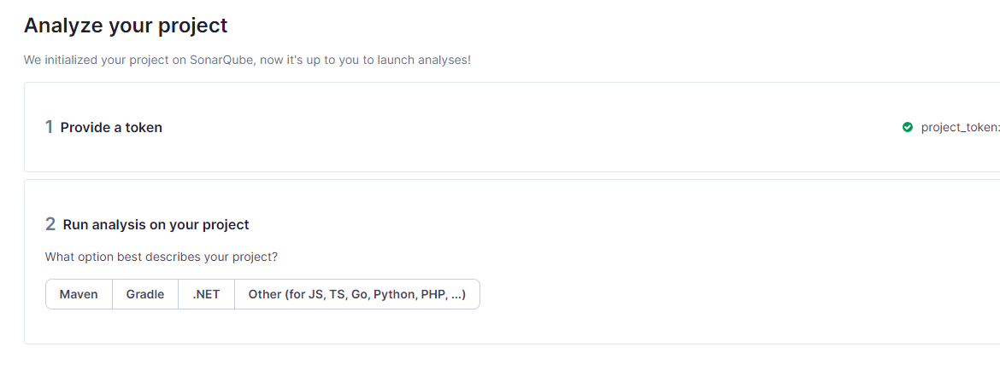

9. Seleccionar .NET Core y almacenar los comandos que propone

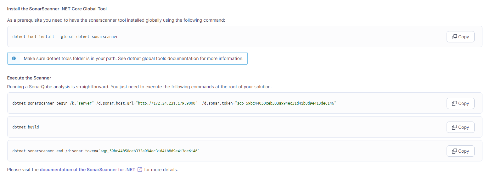


10. Para que funcione con sonar lint, añadir a la isntancia configurada previamente de *sonarqube* el proyecto que se acaba de crear:

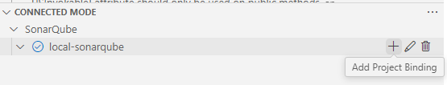
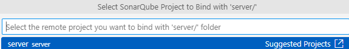

Pulsar en *Share configuration* 

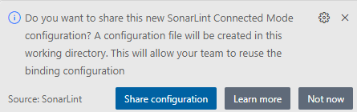

**NOTAS**: *Para visualizar las vulnerabilidades y malas prácticas de seguriad, visualizar la pestaña SECUIRRTY HOSTPOTS de sonarlint*

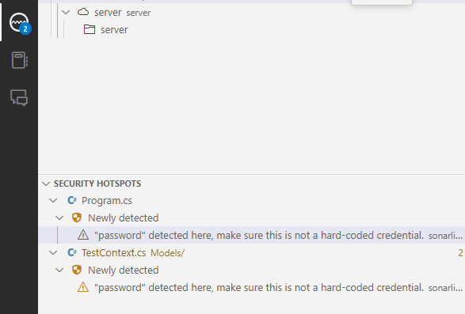

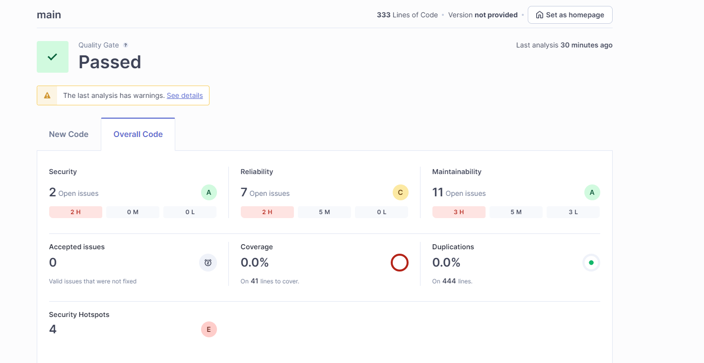

