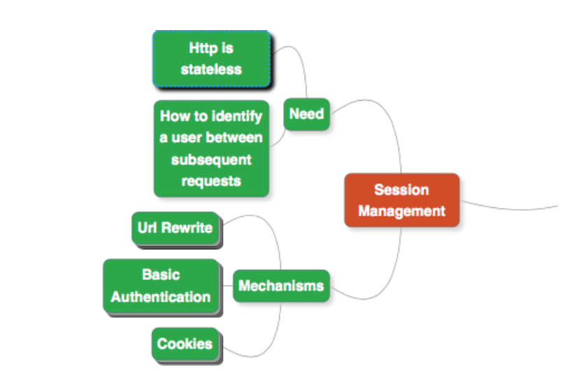

# ADMINSTRACIÓN DE SESIONES

1. Http no está diseñado para mantener sesiones por lo que hay que idear mecanismos a tal efecto
2. Existen varios mecanimos para mantener sesiones:
    - URL Rewrite. Es un mecanismo de mantener sesiones cuando no están habilitadas las cookies.
    - Autenticación Básica: Autentica usuarios tramisitendo las credenciales en cada solicitud.
    - Cookies: Información que se envía en cada petición y se debe respetar entre peticiones
    - Token JWT: Muy común para identificación al utilizar servicios rest y JPA.

## URL Rewrite

URL rewriting (reescritura de URLs) es una técnica utilizada para mantener el identificador de sesión cuando las cookies no están habilitadas en el navegador o no se pueden utilizar. En lugar de almacenar el identificador de sesión en una cookie, se añade directamente a la URL como un parámetro. Esta técnica es común en aplicaciones web que necesitan mantener el estado del usuario entre las solicitudes HTTP sin depender exclusivamente de las cookies.

### ¿Cómo funciona la reescritura de URL para sesiones?
En una sesión HTTP estándar, el servidor genera un identificador de sesión (generalmente un número o cadena aleatoria) para cada usuario. Normalmente, este identificador se almacena en una cookie que se envía con cada solicitud subsecuente al servidor. Sin embargo, si las cookies están deshabilitadas, el servidor puede "reescribir" la URL para incluir el identificador de sesión como un parámetro en cada enlace o formulario.

**Ejemplo:**
Supongamos que una URL original de un sitio web es:

`http://www.ejemplo.com/productos`

Con la reescritura de URL para manejar la sesión, la URL se podría transformar en:

`http://www.ejemplo.com/productos;jsessionid=ABC123XYZ456`

### Riesgos de seguridad asociados con URL rewriting

Si bien la reescritura de URL puede ser útil para mantener las sesiones en ausencia de cookies, presenta varios riesgos de seguridad:

1. *Exposición de identificadores de sesión:* El ID de sesión se hace visible en la URL, lo que facilita su captura en registros del servidor, historiales del navegador o en referencias de sitios web externos. Esto aumenta el riesgo de secuestro de sesión, ya que un atacante que obtiene el ID de sesión podría hacerse pasar por el usuario.
2. *Ataques de tipo Cross-Site Scripting (XSS):* Si la aplicación es vulnerable a XSS, un atacante podría obtener el identificador de sesión que aparece en la URL y robar la sesión del usuario.
3. Referencias a otros sitios web (Referer Header): Cuando un usuario hace clic en un enlace que lo lleva a un sitio externo, el navegador podría enviar el identificador de sesión como parte de la cabecera Referer, exponiendo el identificador de sesión al sitio externo.

### Medidas de mitigación

- Uso de SSL/TLS: Asegurarse de que todas las comunicaciones estén cifradas mediante HTTPS para evitar que el identificador de sesión sea interceptado durante su transmisión.

- Vencimiento de sesión corto: Limitar el tiempo de vida de una sesión para reducir el riesgo de que un identificador de sesión expuesto sea utilizado durante un período largo.

- Regeneración de identificadores de sesión: Después de acciones críticas, como la autenticación o cambios en los privilegios, regenerar el ID de sesión para mitigar el riesgo de reutilización del mismo ID en caso de exposición.

- Evitar la reescritura cuando sea posible: Usar cookies seguras (con HttpOnly, Secure, etc.) siempre que sea posible para almacenar el identificador de sesión en lugar de exponerlo en la URL.